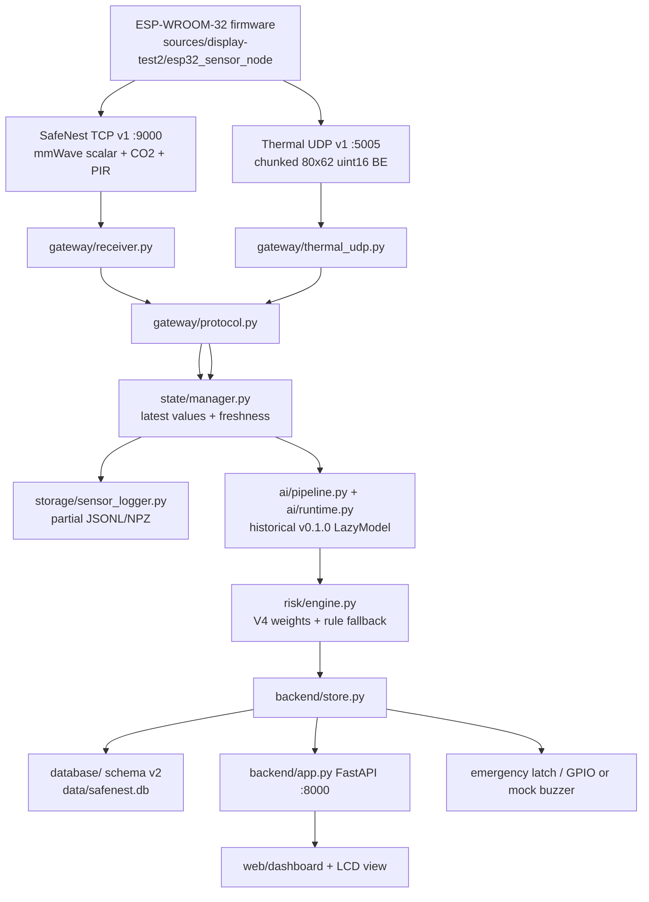
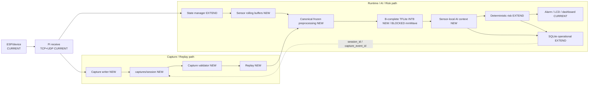

# SafeNest Raspberry Pi AI Runtime Enablement Roadmap

**Document date:** 2026-08-16
**Document ID:** `RP-AI-ENABLEMENT-ROADMAP-01`
**한국어 요약본:** [`20260816_SafeNest_Raspberry_Pi_AI_Runtime_Enablement_Roadmap_01_KO.md`](20260816_SafeNest_Raspberry_Pi_AI_Runtime_Enablement_Roadmap_01_KO.md)
**Roadmap status:** `APPROVED_FOR_RP-A1_ONLY`
**Status meaning:** RP-A0 audit/design is the documentation baseline. The next authorized implementation, after this document is on `main`, is **RP-A1 only** (Capture schema, session/event identity, synthetic fixtures, Capture path/gitignore). Later RP-B/C/D phases, B-complete model activation, and RP-A1 code itself are **not** authorized by this document.

This roadmap describes how the Raspberry Pi integration runtime must be improved so that the team B-complete offline AI candidates can eventually be used correctly with real sensor evidence. It does not implement Capture, change ESP32 firmware, retrain models, change frozen preprocessing, change class maps, change risk thresholds, or change dashboard behavior.

Evidence tags used below:

| Tag | Meaning |
|---|---|
| `CODE_VERIFIED` | Confirmed from current integration source |
| `TEST_VERIFIED` | Confirmed from current integration tests |
| `DOCUMENTED_ONLY` | Present in documents/manifests, not re-executed here |
| `OWNER_REPORTED` | Stated by team PR/handoff, not independently re-run |
| `INFERRED` | Reasonable from adjacent code, labeled as such |
| `PLANNED` | Proposed future architecture, not current code |
| `BLOCKED_HARDWARE` | Requires physical device measurement |
| `BLOCKED_DEPENDENCY` | Requires an external contract, artifact, or owner decision |

Proposed architecture is marked `PLANNED`. Do not treat it as existing code.

---

## 1. Executive Summary

The current Raspberry Pi runtime is a working **latest-state operator system**. It receives ESP32 scalar TCP and Thermal UDP, keeps freshness-aware latest values, evaluates historical v0.1.0 TFLite adapters when inputs happen to match, fuses V4 risk, and publishes to FastAPI, SQLite, LCD-compatible views, and the dashboard. `CODE_VERIFIED`

That is not yet an AI-evidence runtime. The B-complete candidates need unique physical observations, temporally continuous windows, frozen preprocessing, exact INT8 artifacts, and replayable lineage. The current Pi path instead:

- retains latest values and downsamples CO₂ to a 60-second usable tick; `CODE_VERIFIED`
- stores a useful but incomplete operational recorder, not a Capture/evidence contract; `CODE_VERIFIED`
- still loads historical `v0.1.0` models from `model_manifest.json` / `models.yaml`; `CODE_VERIFIED` / `OWNER_REPORTED`
- cannot reconstruct the frozen CO₂ slope contract or the Thermal T-B5 physical-frame contract; `CODE_VERIFIED`
- has no validated mmWave phase stream, so the 300-sample BPF+Z-score model must remain blocked. `BLOCKED_DEPENDENCY`

The governing transformation is:

```text
physical observation
  → ESP/device acquisition
  → Pi receive
  → persistent Capture
  → canonical sensor observation
  → bounded runtime buffer
  → frozen preprocessing
  → exact B-complete TFLite/INT8 artifact
  → sensor-local AI context
  → deterministic risk logic
  → alarm / LCD / dashboard
  → operational SQLite with Capture linkage
```

The Raspberry Pi must never guess or fabricate missing model inputs. Capture must start before B-model activation so real sensor evidence is not lost while AI integration is debugged.

**Implementation authorized by this document:** `APPROVED_FOR_RP-A1_ONLY`. This document does not switch runtime models, start Capture code, or mark real-device validation complete.

---

## 2. Scope and Non-Goals

### In scope

- Architecture audit of the current Pi runtime
- B-complete contract verification from team PR #20
- Capture / runtime-state / AI-buffer / SQLite separation
- Phase-gated Raspberry Pi enablement roadmap
- Replay, provenance, failure, retention, and Phase C placement
- Current-vs-target matrices, dependency matrix, risk register, and definition of done

### Out of scope / not authorized

- Capture or Pi runtime implementation
- ESP32 firmware changes
- Model retraining, quantization, class-map changes, or threshold changes
- Frozen preprocessing changes
- Risk-engine weight/threshold edits
- Dashboard/HMI behavior changes
- Hardware testing or claims of hardware validation
- Treating Capture sessions as training data
- Committing real Capture payloads to Git
- Operating in the sibling standalone AI repository `../embed2` (`https://github.com/sheepmeat/test`)

---

## 3. Repository and AI Baselines

### 3.1 Integration repository

| Item | Value | Evidence |
|---|---|---|
| Local root | `/Users/junwoo/Library/Mobile Documents/com~apple~CloudDocs/대학/2026/safenest-integration` | `CODE_VERIFIED` |
| Git toplevel | same path | `CODE_VERIFIED` |
| Remote | `https://github.com/yuname121/integration.git` | `CODE_VERIFIED` |
| Branch | `main` tracking `origin/main` | `CODE_VERIFIED` |
| Integration HEAD reviewed | `df75640c5a196dea869423770c3938bb90839b83` | `CODE_VERIFIED` 2026-08-16 |
| Prompt-recorded integration SHA | `0cab3afb330b0480a78ed9d74ea50dcf321ea023` | **stale**; that SHA is the team PR branch tip, not this repo |

The prompt’s integration SHA `0cab3af…` is the team `feature/ondevice-ai-b-complete-intermediate-sync` tip. This repository’s `origin/main` is `df75640…` (`Merge pull request #2 from yuname121/agent/update-safenest-integration-0814`).

### 3.2 Frozen AI snapshot currently inside integration

| Item | Value | Evidence |
|---|---|---|
| Snapshot location | `sources/ondevice_ai/` | `CODE_VERIFIED` |
| Recorded origin/main | `fa8cf13` | `DOCUMENTED_ONLY` `LATEST_SOURCE_PROVENANCE.json` |
| Recorded component source | `77b1695ac66fd595bd037e4574d1626b8917654c` | `DOCUMENTED_ONLY` |
| Policy | copied without source edits; not an active second runtime root | `DOCUMENTED_ONLY` |
| Contains C-B6 / T-B5 lock files? | **No** | `CODE_VERIFIED` |
| Runtime default models | historical `v0.1.0` | `CODE_VERIFIED` |

`sources/ondevice_ai/` is therefore **older than the B-complete baseline**. Pi model activation must not treat this snapshot as PR #20.

### 3.3 B-complete AI baseline reviewed

Team PR: [jinsu1011/safenest-embedded-competition#20](https://github.com/jinsu1011/safenest-embedded-competition/pull/20)
Title: `feat(ondevice-ai): sync B-complete offline candidate baseline`
State: **MERGED** `OWNER_REPORTED`

| Record | SHA / pointer | Evidence |
|---|---|---|
| Standalone source | `https://github.com/sheepmeat/test` `efc7e2eb61a49e221ce0ebf6057b0c1617525ad1` | `OWNER_REPORTED` |
| Team base | `3d86bf2a7a4e527d7aba2dfabcb087201ffeb46e` | `OWNER_REPORTED` |
| PR branch | `feature/ondevice-ai-b-complete-intermediate-sync` | `OWNER_REPORTED` |
| PR head | `0cab3afb330b0480a78ed9d74ea50dcf321ea023` | `OWNER_REPORTED` |
| Merge commit reviewed | `6c3faea3126cff0d17565e534d019d344edc6d1a` | `OWNER_REPORTED` |
| Machine-readable pointer | `ondevice_ai/docs/integration/20260816_b_complete_active_offline_candidates.json` | `DOCUMENTED_ONLY` |

**Meaning of B-complete:** frozen offline candidate + reproducibility/deployment contract, sufficient for team integration planning.
**Not meaning:** real-device validation, Pi production deployment, final multisensor validation, or safety certification. `OWNER_REPORTED`

### 3.4 Responsibility boundary

| Owner | Owns | Must not own |
|---|---|---|
| Integration / Pi | ESP→Pi transport consumption, receiver, state, Capture, runtime buffers, AI adapters, inference orchestration, risk/output integration, replay, Pi deployment validation | dataset provenance, training, model comparison, quantization, offline evaluation, AI validators except as consumed contracts |
| Standalone / team `ondevice_ai` | preprocessing selection, training, candidate lock, artifacts, validators, Phase C measurement guides | Pi Capture writer, SQLite schema, dashboard, ESP firmware |

---

## 4. Current Raspberry Pi Runtime

### 4.1 Deployed entry point

```text
deployment/run_pi.sh
  → hil/preflight.py
  → backend/run_backend.py
      → PersistentRuntimeStore (SQLite)
      → SafeNestRuntime
          → TCP :9000 + Thermal UDP :5005
          → SensorStateManager
          → OnDeviceAIPipeline
          → SafeNestRiskEngine
          → RuntimeStore / FastAPI :8000
          → SensorDataLogger
```

`CODE_VERIFIED` `deployment/run_pi.sh`, `backend/run_backend.py`, `backend/runtime.py`

Standalone runners `gateway/run_*_gateway.py` are diagnostic. The combined production path is `run_pi.sh`.

There is **no active `state.json` writer**. `GET /api/state` is generated from the in-memory publication. Legacy `sources/display-test*/**/state.json` files are frozen source material only. `CODE_VERIFIED`

### 4.2 Current architecture



### 4.3 Component inventory

| Component | Path | Current role | Persistence |
|---|---|---|---|
| TCP receiver | `gateway/receiver.py` | Strict framing, per-connection sequence, reconnect | In-memory stats |
| Protocol | `gateway/protocol.py` | `safenest.telemetry.v1` + Thermal 80×62 BE | None |
| Thermal UDP | `gateway/thermal_udp.py` | 9-chunk reassembly, CRC32, timeout, pending bound | In-memory metrics |
| State | `state/manager.py` | Latest per-sensor record, TTL, latest Thermal frame | RAM only |
| AI | `ai/pipeline.py`, `ai/runtime.py` | Lazy v0.1.0 adapters; PIR rule | Latest result in RAM; 30-sample CO₂ deque |
| Risk | `risk/engine.py` | V4 fusion, ppm rules, emergency override | Latest + 30-sample CO₂ deque + PIR no-motion timer |
| Store | `backend/store.py` | Publication, events, emergency latch | RAM; persistent subclass mirrors SQLite |
| SQLite | `database/` | Snapshots and risk/system events | `data/safenest.db` WAL |
| Logger | `storage/sensor_logger.py` | Async mmWave JSONL, 60 s CO₂ JSONL, Thermal NPZ | `data/{mmwave,co2,thermal}` |
| API/UI | `backend/app.py`, `web/dashboard/` | Status, sensors, events, history, WS, dashboard | No separate state file |
| Alarm | emergency HMI + GPIO/mock buzzer | DANGER latch, 119 mock, SMS cooldown | SQLite events + RAM latch |

`CODE_VERIFIED`

### 4.4 Timing currently in force

| Clock / cadence | Current value | Evidence |
|---|---|---|
| ESP scalar telemetry | 1000 ms | `CODE_VERIFIED` `TELEMETRY_PERIOD_MS` |
| SCD40 poll on ESP | readiness poll ~250 ms; cached latest published at 1 Hz | `DOCUMENTED_ONLY` firmware / prior Capture audit
| Thermal requested rate | 25 FPS / divider 4 ≈ 6.25 FPS requested | `CODE_VERIFIED` firmware comment; actual FPS operational |
| CO₂ usable-state promotion | 60 s Pi monotonic | `CODE_VERIFIED` `DEFAULT_CO2_UPDATE_INTERVAL_SECONDS` |
| Risk/AI evaluation | start once, then every 15 s | `CODE_VERIFIED` `evaluation_interval_seconds` |
| Freshness TTL | mmWave/Thermal 3 s; CO₂/PIR 10 s | `CODE_VERIFIED` |
| Thermal UDP timeout | 0.5 s, max 8 pending frames | `CODE_VERIFIED` |

Freshness uses Pi monotonic time. Wall-clock is for operator correlation. `CODE_VERIFIED`

---

## 5. Current Sensor Transport Contracts

### 5.1 Scalar TCP v1

Active schema `safenest.telemetry.v1` carries: `device_id`, `seq`, `uptime_ms`, `resp_rate_bpm`, `heart_rate_bpm`, `co2_ppm`, `pir_motion`, `valid.{respiration,heart,co2}`. `CODE_VERIFIED` `gateway/protocol.py`

**Absent from the active payload:**

- `source_measurement_event_id`
- `source_measurement_monotonic_ms`
- `boot_id`
- humidity / temperature
- mmWave `breath_phase` / waveform / presence
- Thermal pixels (Thermal is UDP-only in the operating sender)

`CODE_VERIFIED`

### 5.2 Thermal UDP v1

ESP sends 9 bounded datagrams (`SNTU`, CRC32, 1200-byte datagrams). Pi reassembles a logical payload of 16-byte metadata + 4960 big-endian `uint16` pixels (80×62). Incomplete, CRC, shape, or min/max failures discard the frame. `CODE_VERIFIED`

ESP uses a one-slot Thermal queue and overwrites an unsent older frame when the network is slow. Those device-side drops are not currently persisted on Pi. `CODE_VERIFIED` firmware comment

`thermal_max_c` is **not** an AI frame. SQLite `thermal_max_temp_c` is currently `NULL` because no Thermal-44 °C contract exists. `CODE_VERIFIED` `docs/PHASE8_SQLITE.md`

### 5.3 mmWave device contract

A separate mmWave owner is validating MR60 `breath_phase`, cadence, and semantic compatibility with the frozen 10 Hz / 30 s / 300-sample BPF+Z-score input. Until that gate passes:

```text
mmWave real phase integration = HOLD / DEPENDENCY
PENDING_MMWAVE_DEVICE_CONTRACT_VALIDATION
```

Pi may design the future interface. Pi must not synthesize phase from respiration/heart scalars. `OWNER_REPORTED` / `BLOCKED_DEPENDENCY`

---

## 6. Current Persistence / Data-Loss Audit

Required sensor table:

| Sensor | Pi receives | Memory only | Persisted | Irreversibly lost | AI input reconstructable? |
|---|---|---|---|---|---|
| mmWave | 1 Hz scalar respiration/heart + validity, packet seq, ESP uptime, device_id. No phase/presence. `CODE_VERIFIED` | Latest scalars; sequence-gap count; no 300-sample window | Every accepted scalar packet in `data/mmwave/*.jsonl`; SQLite latest scalars | Raw `breath_phase`, presence, source measurement identity, future 10 Hz window | **No** for B-complete. Scalar replay only. `BLOCKED_DEPENDENCY` |
| CO₂ | 1 Hz telemetry of latest cached `co2_ppm` + valid flag. No measurement event ID/time. `CODE_VERIFIED` | Every packet’s receive timing; values before 60 s promotion; AI/Risk 30-sample deques | Valid CO₂ only, and only when the 60 s Pi gate is due; SQLite `co2_ppm` summary | Physical event identity; most intermediate values; invalid CO₂ observations; truthful 150 s slope history | **No** for C-B6. Partial scalar replay only. |
| Thermal | Chunked UDP → validated 80×62 `uint16` BE full frame | Pending chunks, loss metrics, latest frame, Pi monotonic receive time | Complete queued frames in NPZ if written and retained; SQLite max raw / AI summary | Incomplete/timeout/CRC frames, frame gaps, CRC/monotonic metadata, logger-queue drops, ESP overwrite drops | Saved pixels are lossless. Session lineage and dropped-frame chronology are **not**. T-B5 physical conversion is **not** reconstructible from raw without a Thermal-44 unit contract. `BLOCKED_HARDWARE` |
| PIR | Boolean in every scalar packet `CODE_VERIFIED` | Latest boolean; Risk no-motion start | Periodic SQLite snapshot only. Logger has **no PIR file**. | Transition timing, packet identity, repeated samples | Periodic summary only. Exact transition replay **no**. |

### 6.1 Other persistence

| Data | Current fate |
|---|---|
| AI predictions | Latest in RAM; Thermal class/probability summarized in SQLite; no model SHA, tensor hash, or source-event linkage |
| Model identity | Loader checks v0.1.0 SHA at load; not recorded per inference in SQLite |
| Risk decisions | Latest in RAM; snapshots + `risk_events` in SQLite |
| Alarm / buzzer / emergency | RAM latch + SQLite emergency fields/events |
| Sensor health | RAM freshness + SQLite status columns |
| Display state | Generated from publication; no `state.json` |
| Logger diagnostics | `/health` counters only; drops are not durable evidence records |

### 6.2 Central irreversible losses

1. Receiver parses to typed objects before any Capture envelope exists.
2. CO₂ is downsampled by Pi elapsed time, not by physical measurement identity.
3. PIR is not written by `SensorDataLogger`.
4. Thermal failures and gaps are memory metrics only.
5. mmWave phase cannot be reconstructed from current traffic.
6. Queue overflow, process crash, and power loss can lose queued logger items.
7. Quota cleanup deletes per-sensor files independently, not as a replayable session.

`CODE_VERIFIED` / Capture companion contract

---

## 7. B-Complete AI Contract Summary

Reviewed from PR #20 merge `6c3faea…` and `20260816_b_complete_active_offline_candidates.json`. `DOCUMENTED_ONLY` / `OWNER_REPORTED`

### 7.1 mmWave — frozen offline candidate

| Field | Frozen value |
|---|---|
| Candidate | `M-B3_CONV1D_GAP_BASELINE_seed42_M-B5_CAL_CLASS_BALANCED_120` |
| Artifact | `models/mmwave/experiments/M-B6_stage_equivalence/M-B3_CONV1D_GAP_BASELINE_seed42_M-B5_CAL_CLASS_BALANCED_120_int8.tflite` |
| SHA-256 | `6dff6aaa72c79d76715d40cf7e32bb1e6cd9b2c2e3ac78eaf2fda737561430c5` |
| Input | INT8 `[1,300,1]`, 10 Hz, 30 s, 300 samples |
| Preprocessing | `BPF_ZSCORE` (`M-B1_D0_B1_Z1` / `M-B10B_SELECTED_REAL_CANDIDATE_BPF_ZSCORE_V1`) |
| INT8 scale/zp | `0.041720833629369736` / `-3` |
| Output | INT8 `[1,3]`, scale `0.00390625`, zp `-128` |
| Class map | `0=NORMAL`, `1=RAPID_OR_ABNORMAL`, `2=APNEA` |
| APNEA meaning | Voluntary breath-hold **proxy**, not clinical apnea |
| Runtime default | Historical `mmwave_resp_int8_v0.1.0.tflite` still default; v0.1.0 is `deployment_allowed=false` (class collapse) |
| Device domain | **NOT COMPLETE**. Pi must not implement live phase input yet. |

Historical v0.1.0 uses z-score-only (`mean=0.00609198`, `std=2.50138`) and a different quantization. Pointing `models.yaml` at the candidate file without the BPF contract is incorrect. `CODE_VERIFIED` / `DOCUMENTED_ONLY`

### 7.2 CO₂ — frozen C-B6 occupancy candidate

| Field | Frozen value |
|---|---|
| Candidate | `C_B6_REDUCED_CO2_SLOPE_CANDIDATE_001` |
| INT8 artifact | `models/co2/candidates/c_b6/full_integer_int8.tflite` |
| INT8 SHA-256 | `c5969b367f5b5e28c4d27f1bdd6220f7d02da92e99604e3f85c9f1291e98dd3b` |
| Feature order | `CO2`, `CO2_slope` |
| Forbidden inputs | Temperature, Humidity, Light, time-of-day, previous predictions, sensor metadata, new derived features |
| Slope method | `ENDPOINT_DIFFERENCE` over source-clock history |
| History | 150 s; minimum 2 samples; minimum elapsed 150 s |
| Gap policy | Restart history after gap `> 90 s` |
| Timestamp basis | `SOURCE_ACQUISITION_CLOCK` |
| Scaler | TRAIN-only `StandardScaler`; fingerprint `a92123ad37e9b284929ba0fe53179126345d54d487ec4b3a73c910d00490a462` |
| Scaler mean | `[606.5058118345612, 0.011527303414630624]` |
| Scaler scale | `[314.3524240597083, 5.661675596121919]` |
| INT8 input | `[1,2]`, scale `0.03921568766236305`, zp `0` |
| INT8 output | `[1,1]` logistic occupancy score, scale `0.00390625`, zp `-128` |
| Threshold | `0.43`, `TRAIN_INTERNAL_ONLY` |
| Class map | `0=VACANT`, `1=OCCUPIED`; semantic `ROOM_OCCUPANCY` |
| Risk/safety semantic | **NONE**. Occupancy is not a CO₂ safety threshold, sensor health, or multisensor risk. |
| Device domain | SCD40 Phase C **NOT COMPLETE** |

This is a **breaking change** versus the current Pi adapter:

| Item | Current Pi / v0.1.0 | C-B6 |
|---|---|---|
| Features | `CO2_slope, Humidity, CO2` | `CO2, CO2_slope` |
| Input shape | `[1,3]` | `[1,2]` |
| Output | `[1,2]` softmax | `[1,1]` logistic |
| Humidity | required; currently missing → `INPUT_UNAVAILABLE` | forbidden |
| Slope window | 30 promoted 60 s samples, elapsed-minutes over deque | 150 s source-clock endpoint difference, 90 s gap reset |
| Artifact in local snapshot | v0.1.0 + C-B5 four-feature candidate | C-B6 **not present** in `sources/ondevice_ai/` |

`CODE_VERIFIED` vs `DOCUMENTED_ONLY`

### 7.3 Thermal — frozen T-B5 FULL_INT8

| Field | Frozen value |
|---|---|
| Candidate | `FULL_INT8` / `SMALL_CNN_BASELINE_V1_P1_full_int8.tflite` |
| Logical path | `T-B4/artifacts/SMALL_CNN_BASELINE_V1_P1_full_int8.tflite` |
| SHA-256 | `fa9730c29535477a3994c11e664474a0ca0116afaaa172889f47446ab2ac46be` |
| Size | 318280 bytes |
| Git binary | **`binaries_tracked_in_git: false`**, `EXTERNAL_SSD_ONLY` |
| Input | INT8 `[1,62,80,1]`, scale `0.31791284680366516`, zp `-125` |
| Output | INT8 `[1,3]`, scale `0.00390625`, zp `-128` |
| Float preprocessing lock | `P1_TRAIN_FITTED_GLOBAL_ZSCORE` on **Celsius** frames; TRAIN mean `22.769290618485442`, std `2.8684523405441222` |
| Offline geometry source | SDT canonical `(62,80)` from distributed `(480,640)` via `G1_FIXED_ASPECT_CROP_BILINEAR`; unit `°C = (encoded_uint16 - 27315) / 100` for **SDT**, not Thermal-44 |
| Class compatibility layer | `NOT_HUMAN` / `HUMAN_NORMAL` / `HUMAN_FALL` |
| `HUMAN_FALL` meaning | `DERIVED_POSTURE_PROXY` from source `LYING`. **Not** a verified `FALL_EVENT`. |
| Device domain | Thermal-44 real-device **NOT COMPLETE**; orientation/unit `UNVERIFIED` |

Current Pi Thermal path uses **per-frame min-max to [0,1]** then v0.1.0 quantization `scale=0.003921568859368563`, `zp=-128`. That is **not** the T-B5 contract. Feeding raw or min-max frames into T-B5, or claiming `HUMAN_FALL` is a fall event, is forbidden. `CODE_VERIFIED` / `DOCUMENTED_ONLY`

Exact Pi inference graph (Celsius conversion → P1 z-score → INT8 vs converter-absorbed quantization) must be frozen by the AI owner in RP-B0. Do not invent a second Thermal-44 Kelvin formula. `OWNER_DECISION_REQUIRED` / `BLOCKED_HARDWARE`

### 7.4 PIR

No PIR AI model exists in current source or B-complete. PIR remains supporting evidence / risk context. `CODE_VERIFIED`

---

## 8. Current-vs-Target Gap Analysis

| Component | Current Pi behavior | B-complete requirement | Gap | Required Pi change | External dependency |
|---|---|---|---|---|---|
| CO₂ | 60 s promoted ppm; humidity-gated v0.1.0 `[1,3]`; slope from 30-sample deque | Unique SCD40 events; 150 s endpoint slope; `[CO2, CO2_slope]`; INT8 `[1,2]` logistic; threshold 0.43 | Physical identity missing; wrong features/shape/output; wrong slope; snapshot lacks C-B6 | Capture unique events; runtime buffer; canonical C-B6 adapter; fail closed on warmup/gap | ESP measurement identity; AI snapshot/artifact sync; SCD40 Phase C |
| Thermal | UDP reassembly; latest frame; per-frame min-max v0.1.0 `[1,62,80,1]` zp `-128` | Full raw frame Capture; Thermal-44→canonical geometry/unit; P1/T-B5 INT8 zp `-125`; posture proxy only | Wrong preprocessing; T-B5 binary missing from git; no unit contract; NPZ not sessionized | Full-frame Capture; canonical converter once unit exists; T-B5 loader; no `FALL_EVENT` rewrite | T-B5 binary deployment; Thermal-44 unit/orientation; AI preprocessing freeze |
| mmWave | Scalar only; v0.1.0 blocked by manifest; no 300-sample window | 10 Hz phase, 300 samples, BPF_ZSCORE, INT8 `[1,300,1]` zp `-3` | Phase stream absent and unvalidated | Design Capture placeholder only; implement after device-contract gate | MR60 phase contract |
| PIR | Latest bool; no raw file; risk no-motion rule | Transition/event evidence; supporting risk context | Transitions lost | Capture first-state + transitions | None for Capture; presence source still incomplete |
| Model loading | `LazyModel` → `model_manifest.json` v0.1.0; mmWave blocked | Resolve B-complete from active-candidate pointer; SHA-256; interpreter compatibility | Defaults are historical; C-B6/T-B5 not in local snapshot | Dedicated activation phase; checksum; missing-artifact fail closed | Team-approved artifact location; snapshot sync |
| Preprocessing | Interpreter-internal v0.1.0; experimental mmWave BPF unused by default | One canonical frozen implementation for runtime and replay | Duplication risk A/B/C | Shared preprocessing module/contract | AI owner freeze of Pi-callable functions |
| Capture | Hourly JSONL/NPZ logger, quota cleanup, no sessions | Sessionized append-only evidence + Thermal binary | Not an evidence contract | Capture v1 | CO₂ identity for exact slope replay |
| SQLite | Operational snapshots/events, schema v2 | Keep as summary; add Capture/inference linkage | No evidence IDs | Additive linkage columns/JSON | None |
| Replay | NPZ/JSONL can be read ad hoc; no validator | Capture → canonical → frozen prep → exact model → compare | Missing | Replay layer after Capture | Models/artifacts |
| Risk integration | AI Thermal used; CO₂ occupancy unused for score; mmWave AI unused due to missing input; ppm/rpm/PIR rules | AI is context; do not replace ppm/rpm rules with occupancy/APNEA proxy | Semantic confusion risk if C-B6 OCCUPIED or HUMAN_FALL is treated as emergency without policy | Explicit context fields; keep V4 rules until a reviewed policy change | Owner decision: whether occupancy context changes fusion; do not change thresholds in this roadmap |

---

## 9. Target Raspberry Pi Architecture



Status legend:

| Mark | Meaning |
|---|---|
| CURRENT | Keep and extend |
| NEW | Required Pi work |
| FUTURE | After a named gate |
| BLOCKED | External dependency |

Four storage responsibilities remain separate:

| Layer | Purpose | Mechanism |
|---|---|---|
| A. Capture / evidence | Real-device evidence, replay, fault diagnosis, model-input reconstruction, Phase C | `captures/<session>/` JSONL + Thermal NPZ |
| B. Runtime sensor state | Latest valid state, freshness, health, availability | `SensorStateManager` RAM |
| C. AI rolling buffers | CO₂ 150 s history, future mmWave 300-sample window, latest Thermal frame | Bounded RAM, reset on continuity breaks |
| D. Operational summary | Risk history, alarms, AI outputs, operator views | Existing SQLite |

Do not force one mechanism to perform all four jobs.

---

## 10. Capture v1

Adopt the companion contract rather than inventing a second layout.

Recommended session layout `PLANNED`:

```text
captures/
└── <session_id>/
    ├── manifest.json
    ├── events_0001.jsonl
    ├── events_0002.jsonl
    ├── thermal/
    │   ├── frames_0001.npz
    │   └── ...
    ├── inference/
    │   └── records_0001.jsonl
    └── session_close.json
```

This matches existing NumPy use, keeps 4960 pixels out of generic JSONL, and stays out of `data/safenest.db`.

### 10.1 Why not reuse `storage/sensor_logger.py` as-is

Preserve its useful ideas (async queue, no disk I/O in receive callbacks, Thermal batching, `/health` counters). Replace the contract:

- sessionized instead of hourly independent sensor directories
- all sensors including PIR and explicit loss events
- no 60 s CO₂ downsample in persistent Capture
- monotonic receive time, CRC, and payload checksums
- capture health distinct from SQLite health
- retention by closed session, not per-sensor file deletion

Classification: `EXTEND` patterns, `REPLACE_LATER` the current file-as-contract.

### 10.2 Thermal payload format

Recommendation: **chunked lossless NPZ**, `allow_pickle=False`.

| Option | Write | Compression | Power-loss | Replay | Checksum | Random access | Complexity |
|---|---|---|---|---|---|---|---|
| JSONL pixels | Poor | Weak | Line-append OK | Awkward | Per line | Poor | Low, rejected |
| NPY per frame | Many files | None | Partial files | Easy | Sidecar | Easy | Medium |
| **NPZ batch** | Good | ZIP deflate, lossless uint16 | Needs temp+rename | Easy | Archive + per-frame SHA | Index in event log | Medium; already used |
| Custom archive | Best potential | Tunable | Custom | Custom | Custom | Custom | High, unnecessary now |

NPZ is selected because the current logger already writes `(batch, 62, 80) uint16` with `allow_pickle=False`, and Capture only needs to add session metadata, CRC, monotonic time, and atomic close. `CODE_VERIFIED` current logger / `PLANNED` Capture

---

## 11. Session / Timestamp / Provenance Contract

### 11.1 Session lifecycle

Recommended for competition use: **one Capture session per integrated Pi application run**, with optional operator-started experiment sessions. ESP reconnects stay inside the session as transport events. A new process start opens a new session. `PLANNED`

| Step | Behavior |
|---|---|
| Create | New `session_id`, directory, `manifest.json` |
| Active | Append-only JSONL + Thermal archives |
| Rotation | Close segment, open next; not a session close |
| Close | Drain writers, checksum, `session_close.json` |
| Crash | No close marker; next start reports unclean previous session |

### 11.2 Timestamp meanings — never collapse to one `timestamp`

| Name | Source | Use |
|---|---|---|
| Device/source measurement time | SCD40/MR60/Thermal acquisition clock when the contract supplies it | Slope, phase cadence, uniqueness |
| Device uptime | ESP `uptime_ms` | Reboot/discontinuity detection |
| Pi receive wall-clock | `time.time()` | Operator correlation |
| Pi receive monotonic | `time.monotonic()` | Freshness, receive order |
| AI inference time | evaluation clock | Provenance |
| Risk-decision time | 15 s evaluator clock today | Provenance |
| Display/alarm publication time | store publish clock | HMI/SQLite |

`CODE_VERIFIED` that the current runtime already distinguishes wall vs monotonic for receive; Capture must preserve that distinction and add source measurement time when the device contract supplies it.

### 11.3 Common Capture metadata

Populate only fields the runtime can actually know. Missing values are explicit unavailability, not invented IDs.

| Field | Can populate now? | Notes |
|---|---|---|
| `schema_version` | Yes | Capture schema |
| `session_id` | Yes after RP-A1 | Pi generated |
| `sensor_type` | Yes | `co2` / `thermal` / `pir` / `mmwave` / `runtime` |
| `device_id` | Yes for TCP | Thermal UDP currently has no device_id in the frame object; record unavailability or attach from last scalar peer by explicit policy, do not silently invent |
| `boot_id` | **No** | Device contract absent; `null` + reason |
| `packet_sequence` | Yes | Transport seq, not physical measurement ID |
| `device_uptime_ms` | Yes | ESP uptime |
| `source_measurement_event_id` | **No** on active v1 | Required for exact CO₂ uniqueness; until then `measurement_identity_unavailable=true` |
| `source_measurement_monotonic_ms` | **No** on active v1 | Same |
| `pi_receive_wall_time` | Yes | Already available |
| `pi_receive_monotonic_time` | Yes | Currently not persisted |
| `parse_valid` | Yes | Decoder/CRC result |
| `sensor_valid` | Yes | Source valid flags |
| `stale` | Runtime-derived only | Do not rewrite source evidence as stale |
| `error_code` / `error_reason` | Yes | Failures must be events |
| `payload_reference` | Yes for Thermal | Repo-relative path, never `/Users/...` |

---

## 12. CO₂ Runtime Plan

Target path `PLANNED`:

```text
SCD40 measurement
  → ESP cache + telemetry
  → measurement event identity + source time   [ESP_CONTRACT_DEPENDENCY]
  → Pi Capture (unique physical events)
  → runtime history buffer (150 s + gap margin)
  → frozen ENDPOINT_DIFFERENCE CO2_slope
  → TRAIN-only scaler, feature order [CO2, CO2_slope]
  → C-B6 INT8 [1,2]
  → occupancy probability vs threshold 0.43
  → VACANT / OCCUPIED context
  → risk still uses ppm/slope safety rules unless a later reviewed policy says otherwise
```

### 12.1 Persistent Capture vs runtime buffer vs reset

| Layer | Store | Dedup | Reset |
|---|---|---|---|
| Capture | Every unique SCD40 measurement; until identity exists, every transport observation marked `measurement_identity_unavailable` | Same physical ID must not become another measurement. Do **not** use value equality as identity. Do **not** apply the 60 s logger gate to Capture. | Never periodic. Session close / retention only. |
| Runtime buffer | `(capture_event_id, source_time or receive_monotonic_fallback, ppm, valid)` for ~150 s plus margin for the 90 s gap check | Retransmissions of the same event do not append | New session, device reboot/uptime rollback, gap `> 90 s`, long invalid period, timestamp discontinuity |
| Derived slope | RAM + inference provenance; not a replacement for ppm | Recompute from buffer | Invalidated with the buffer |

Wall-clock hourly/minute timers must not reset the slope history.

### 12.2 Fail-closed inference statuses

| Condition | Status | Inference |
|---|---|---|
| < 2 valid samples or elapsed < 150 s | `INPUT_WARMUP` / `FEATURE_UNAVAILABLE_WARMUP` | `NO_INFERENCE` |
| Internal gap > 90 s | `INPUT_INVALID` / `FEATURE_UNAVAILABLE_GAP_RESTART` | `NO_INFERENCE`; reset buffer |
| Non-finite ppm, parse invalid | `INPUT_INVALID` | `NO_INFERENCE` |
| State STALE vs evaluation | `INPUT_STALE` | `NO_INFERENCE` |
| C-B6 artifact missing/hash mismatch | `MODEL_UNAVAILABLE` | `NO_INFERENCE`; ppm risk rules continue |
| Valid features | occupancy context | Map logistic ≥ 0.43 → `OCCUPIED` else `VACANT`. Do not treat scores as calibrated probabilities. |

Do not convert invalid input into `VACANT`.

### 12.3 Cadence warning

Offline C-B6 was trained on UCI occupancy with nominal ~60 s source cadence. SCD40 data-ready is typically ~5 s and ESP currently publishes the latest cached ppm at 1 Hz. Device-domain gap `DEVICE_UCI_CADENCE_DOMAIN_GAP` remains. Pi must compute the frozen formula on real event times, not resample to fake UCI cadence. `DOCUMENTED_ONLY` / `BLOCKED_HARDWARE`

---

## 13. Thermal Runtime Plan

Target path `PLANNED`:

```text
Thermal-44
  → ESP chunked UDP
  → Pi reassembly + CRC/shape/minmax     [CURRENT]
  → full raw frame Capture               [NEW]
  → physical-unit conversion             [BLOCKED_HARDWARE until Thermal-44 unit]
  → canonical orientation/geometry       [BLOCKED_HARDWARE]
  → frozen T-B5 preprocessing            [NEW after AI freeze]
  → FULL_INT8 inference                  [MODEL_ARTIFACT_DEPENDENCY]
  → NOT_HUMAN / HUMAN_NORMAL / HUMAN_FALL context
```

### 13.1 Already implemented vs new

| Piece | Status |
|---|---|
| Chunked UDP, CRC, 80×62, min/max, timeout | CURRENT `CODE_VERIFIED` |
| Latest full frame in RAM | CURRENT |
| NPZ batch of raw uint16 | CURRENT partial logger |
| Sessionized Capture + checksum + monotonic + loss events | NEW |
| Thermal-44 raw → °C | BLOCKED; SDT formula must not be silently reused |
| Orientation/transpose/flip contract | BLOCKED |
| P1 global z-score / T-B5 INT8 | NEW after RP-B0 freeze |
| T-B5 binary on Pi | MODEL_ARTIFACT_DEPENDENCY |
| `thermal_max_c` as model input | FORBIDDEN |

### 13.2 Runtime memory

T-B5 is frame-only. Runtime RAM needs the current validated frame and at most a tiny queue for evaluator/Capture handoff. Unlimited Thermal frames in RAM are forbidden. Persistent Capture is separate.

### 13.3 Semantics

Preserve original posture semantics. `LYING` / `HUMAN_FALL` is a derived posture proxy. Risk may currently emergency-override on `HUMAN_FALL` with confidence ≥ 0.8 (`CODE_VERIFIED`). That existing override must be reviewed in RP-C0 so a lying-proxy class is not silently treated as a verified fall event. This roadmap does not change that threshold.

---

## 14. mmWave Dependency Plan

Do **not** implement the current model input on Pi now.

Gate:

```text
MR60 breath_phase real-device contract
  → cadence verification
  → semantic compatibility with 10 Hz / 300 samples / BPF_ZSCORE
  → only then Pi phase Capture, rolling window, gap handling, INT8 inference
```

Until the gate:

- Continue recording scalar respiration/heart as operational/Capture observations.
- Write `phase_unavailable` rather than a fake window.
- Keep mmWave AI `INPUT_UNAVAILABLE`; risk continues to use rpm rule fallback.
- Do not resample heart/respiration into phase.
- Do not enable v0.1.0 (class collapse) or the B-complete candidate as a live default.

This is RP-B3, blocked by `MMWAVE_DEVICE_CONTRACT_DEPENDENCY`.

After the gate, the rolling buffer is 300 samples at the verified cadence, with gap handling from the frozen contract (historical V4 text mentioned 0.5 s; the B-complete contract must be re-read at unblocking time and not assumed here). `DOCUMENTED_ONLY` / `BLOCKED_DEPENDENCY`

---

## 15. PIR Integration Plan

Keep PIR simple. No PIR model.

| Preserve | How |
|---|---|
| Latest state | `SensorStateManager` CURRENT |
| Transition event | Capture on first observation and boolean change |
| Source timing | Packet seq + ESP uptime + Pi wall/monotonic |
| Validity | Parse/sensor valid; stale via TTL |
| Risk | Existing no-motion rule with presence confirmation |

Do not persist every 1 Hz duplicate `false/false` as a new observation. Sequence gaps still need transport events or counters. Replay forward-fills last valid state until the next transition or continuity break.

---

## 16. AI Artifact / Model Resolution

Historical defaults still in force:

| Sensor | Default artifact | B-complete artifact |
|---|---|---|
| Thermal | `thermal_fall_int8_v0.1.0.tflite` SHA `5b56da8d…` | T-B5 SHA `fa9730c2…` **not in git** |
| CO₂ | `co2_occupancy_int8_v0.1.0.tflite` SHA `3a8c86c4…` | C-B6 SHA `c5969b36…` **not in local snapshot** |
| mmWave | `mmwave_resp_int8_v0.1.0.tflite` blocked | M-B3 INT8 SHA `6dff6aaa…` present in snapshot as offline candidate, `deployment_ready=false` |

`CODE_VERIFIED` / `DOCUMENTED_ONLY`

### 16.1 Activation is a dedicated phase (RP-B0), after Capture

Do not merely retarget `models.yaml`. Before switching any runtime default verify:

- team-approved artifact availability on the Pi
- SHA-256
- manifest / candidate pointer
- input contract, preprocessing profile, class map, dtype, quantization
- LiteRT interpreter compatibility
- tests for fail-closed missing/mismatch
- explicit operator/config opt-in, not silent replacement of v0.1.0 tests

### 16.2 Thermal binary deployment strategy

The T-B5 INT8 file is `EXTERNAL_SSD_ONLY`. Questions that require an owner decision:

| Option | Recommendation |
|---|---|
| Commit the binary to integration git? | Only if the team explicitly accepts ~318 KB and license/provenance; currently excluded |
| Release attachment? | Acceptable if SHA-256 is in git and download is pinned |
| Fetch at deploy time? | Allowed only with checksum, fail closed if missing, no unpinned URL |
| Copy during Pi provisioning? | **Preferred for competition**: provisioned path + SHA-256 in candidate pointer; preflight fails if absent |
| Missing on Pi? | `MODEL_UNAVAILABLE`; Capture and ppm/rpm rules continue; never skip checksum |

Do not assume the file exists on the Pi.

### 16.3 Integration snapshot sync

RP-B0 requires the B-complete contracts inside the integration tree or an equivalent pinned vendor path. That is an AI baseline copy, not retraining. Runtime defaults must remain v0.1.0 until the activation checklist passes. `AI_BASELINE_DEPENDENCY`

---

## 17. Preprocessing / Input Contract Validation

### 17.1 One canonical implementation

Avoid three drifting copies (offline / Pi / replay). Prefer:

```text
frozen B preprocessing functions
  reused by Pi runtime
  reused by replay
  covered by the same fixtures
```

Where the standalone code is importable without pulling training stacks, wrap it through `ai/` adapters. If not, copy the frozen numeric contract into one Pi module with checksummed fixtures — still one implementation, not two formulas.

### 17.2 Per-inference validation

Before invoke, validate shape, dtype, feature order, physical unit, validity, temporal continuity, and preprocessing-state identity.

| Failure | Result |
|---|---|
| Missing required field / wrong shape / NaN | `INPUT_INVALID` / `NO_INFERENCE` |
| History warming | `INPUT_WARMUP` |
| Freshness TTL exceeded | `INPUT_STALE` |
| Artifact missing/hash/interpreter | `MODEL_UNAVAILABLE` |
| mmWave phase gate closed | `INPUT_UNAVAILABLE` / blocked |

Invalid input must not become a normal-class prediction.

---

## 18. AI Provenance

Per inference, record at least `PLANNED`:

```text
inference_id
session_id
source event/frame references
model_id
model_sha256
model_format
preprocessing_profile
input_contract_version
input_validation_result
input_tensor_hash (optional but useful)
output scores / selected class
threshold used (CO₂ 0.43) without claiming calibration
risk result / reasons references
inference_time / risk_time
```

Model outputs are not assumed to be calibrated probabilities. C-B6 threshold is `TRAIN_INTERNAL_ONLY`. Thermal/mmWave INT8 dequantized vectors are scores, not clinical probabilities. `DOCUMENTED_ONLY`

Store inference JSONL under the Capture session. Put only summaries + IDs in SQLite.

---

## 19. SQLite / Operational Logging

Keep SQLite as the operational summary store. Schema v2 already has snapshots, risk events, emergency/buzzer fields. `CODE_VERIFIED` `database/schema.sql`

Do not put raw Thermal frames or 300-sample phase windows into SQLite.

### 19.1 Future linkage

Additive, after inspecting current columns. Prefer nullable JSON/text fields rather than a breaking rewrite:

| SQLite location | Link |
|---|---|
| `sensor_snapshots` | `session_id`, latest `capture_event_id` per sensor, `inference_id` |
| `risk_events.details_json` | `session_id`, `capture_event_id`s, `inference_id`, model SHA |

Exact column names are an RP-B4 design choice; do not bikeshed them before schema migration tests.

Restart restoration currently rebuilds status/risk/emergency, not sensor values or Thermal bytes. That should remain true. `CODE_VERIFIED`

---

## 20. Replay

Dedicated phase RP-A5 (Capture replay) then RP-B4 (inference equivalence).

```text
stored Capture
  → validator (manifest, checksums, schema, NPZ dtype/shape)
  → canonical observation stream
  → same frozen preprocessing
  → same exact model artifact
  → prediction
  → compare with original runtime result if provenance exists
```

Replay must be able to answer:

| Question | How |
|---|---|
| Was source data wrong? | Capture `sensor_valid` / `error_code` |
| Was transport incomplete? | `transport_gap`, incomplete Thermal events, logger/capture drops |
| Was the observation stale? | Runtime stale events vs source evidence |
| Was preprocessing different? | Profile/hash in provenance vs replay |
| Was the wrong model used? | `model_sha256` |
| Did quantization change output? | Float reference vs INT8 comparison fixtures, not live guessing |
| Did risk rather than AI trigger the alarm? | Risk reasons vs AI class; emergency override flags |

If CO₂ identity is unavailable, replay must say exact slope reconstruction is unavailable rather than silently deduplicating by ppm value.

---

## 21. Risk Engine Integration

Current consumption `CODE_VERIFIED` `risk/engine.py`:

| Component | Uses real sensor? | Uses AI? | Missing/stale | Emergency |
|---|---|---|---|---|
| Thermal | LIVE required | **Yes**, AI class/score; no rule fallback | unavailable | `HUMAN_FALL` + confidence ≥ 0.8 → DANGER 100 |
| mmWave | LIVE + rpm | AI if 300-window present (currently never) | rpm rule fallback 12–20 | `APNEA` only if `apnea_verified is True` (currently always false) |
| CO₂ | LIVE + ppm | Occupancy **not** used for score | unavailable | ppm 1000/2500 and slope 15 ppm/min rules |
| PIR | LIVE + bool | rule only | unavailable; no-motion timer reset | none; long no-motion needs presence |

AI is context, not autonomous safety authority, except the existing Thermal confidence override. Introducing B-complete outputs:

- C-B6 `OCCUPIED`/`VACANT` → metadata/context only unless a later reviewed policy changes fusion. Do not replace 1000/2500 ppm rules with occupancy.
- T-B5 `HUMAN_FALL` → still a posture proxy; RP-C0 must not silently strengthen the emergency override.
- mmWave classes → still blocked; when enabled, APNEA remains unverified without an explicit verification contract.

Do not change V4 weights `0.35/0.35/0.15/0.15` or 30/60 thresholds in this roadmap.

---

## 22. Buffer Reset / Rotation / Retention

| Data | Reset / rotate | Delete |
|---|---|---|
| Persistent Capture | Session close; file rotation by size/time | Oldest **closed** sessions after budget/free-space policy. Never periodic wipe of the active session. |
| AI rolling buffers | New session, reboot, reconnect+continuity break, gap, timestamp discontinuity, long invalid | RAM only; deleting RAM must not delete Capture |
| Current state | Replaced by newer valid state per TTL | Process lifetime |
| SQLite | Separate retention/archival | Do not erase because an AI buffer reset |

Rotation ≠ reset ≠ retention deletion. See §10 and §22 of this roadmap.

Git ignore: add `captures/` before any real session exists. Current `.gitignore` already ignores `data/mmwave|co2|thermal/*` and `*.db`. `CODE_VERIFIED`

---

## 23. Failure Handling

Capture failure must be observable. Do not report Capture enabled when nothing is persisted.

| Failure | Behavior `PLANNED` |
|---|---|
| Disk full | `capture_failed` or `degraded` before drop; retention only under policy |
| Writer failure | Bounded retry, then failed; identity preserved |
| Queue overflow | `capture_drop` event/counters; `degraded`; receive path stays live |
| Corrupt payload | Do not rewrite history; quarantine; error event |
| Rotation failure | Do not overwrite old segment; failed |
| Process crash / power loss | No false `session_close.json`; next start unclean |
| SQLite failure | Separate from Capture health; memory fallback already exists `CODE_VERIFIED` |

Health states: `capture_healthy` / `capture_degraded` / `capture_failed`. Expose on `/health`.

---

## 24. Raspberry Pi Performance Validation

Later hardware phase RP-C2. **Not passed now.** Measure:

CPU, RAM, disk throughput, storage growth, Thermal write bandwidth, inference latency, model load time, queue depth, network loss, Pi temperature, multi-hour runtime, restart recovery.

Do not report these as complete from this documentation pass.

---

## 25. Real-Device Phase C

Place formal device-domain validation **after** Capture, input reconstruction, model activation, and replay work.

Separate tracks:

| Track | Depends on |
|---|---|
| MR60 / M-C | Device phase contract + Pi phase Capture/window |
| SCD40 / C-C | Measurement identity + C-B6 slope reproduction |
| Thermal / T-C | Unit/orientation + T-B5 artifact + full-frame Capture |
| Multisensor synchronized | All three + clock/session alignment |

Capture is not automatically training data:

```text
Capture → quality review → scenario/label review
  → privacy/consent review where applicable
  → dataset admission → canonicalization → training
```

That training path lives in the AI repository, not in Pi runtime phases.

---

## 26. Phase-by-Phase Roadmap

Existing integration phases are `PHASE 1`–`PHASE 10` plus HIL. No `RP-*` IDs exist. This series uses prefix **`RP-`** and does not collide. `CODE_VERIFIED`

RP-A0 is satisfied as a documentation gate by this document. Implementation starts at RP-A1 only after this roadmap is reviewed onto `main`, on a **separate** branch. This PR does not implement RP-A1.

---

### RP-A0 — Current Pi Runtime / Persistence Audit

**Objective:** Freeze what the Pi actually does and what it currently loses, so later phases do not design against directory names.

**Why this phase exists:** Latest-state architecture cannot be extended blindly into B-complete windows.

**Preconditions:** Integration checkout on a known SHA.

**In scope:** Source audit, persistence table, AI default identification, Capture/state/SQLite separation.
**Out of scope:** Code changes, ESP changes, model activation.

**Current code affected:** None (read-only).
**Expected implementation:** This roadmap Markdown.

**Inputs:** Integration tree; PR #20 contracts.
**Artifacts:** This Markdown.

**Tests / validators:** Static documentation review only.

**Acceptance criteria:** End-to-end flow, storage table, v0.1.0 defaults, C-B6/T-B5/mmWave contracts, and four-layer storage split are recorded with evidence tags.
**Blocking conditions:** None remaining for documentation; field-encoding freeze waits for RP-A1 review.

**Owner role:** Pi runtime owner.
**Required reviewer:** Team integration reviewer.

**Evidence produced:** `CODE_VERIFIED` audit.
**Next-phase authorization:** RP-A1 after reviewer acceptance.
**Dependency class:** `PI_IMPLEMENTABLE_NOW` (docs already produced).

---

### RP-A1 — Capture v1 Schema and Session Contract

**Objective:** Freeze machine-readable Capture schema, session IDs, event types, timestamp fields, and Thermal payload index without writing production sessions.

**Why:** Writers without a frozen schema will drift.

**Preconditions:** RP-A0 accepted.

**In scope:** JSON schemas, fixtures, `.gitignore` for `captures/`, checksum rules.
**Out of scope:** Live writer on the receive path; ESP firmware; models.

**Current code affected:** `docs/`, future `capture/` schema modules, `.gitignore`.
**Expected implementation:** Schema + synthetic fixtures only.

**Inputs:** This roadmap’s Capture v1 section and current `storage/sensor_logger.py` behavior.
**Artifacts:** Schema files, example `manifest.json`, synthetic event lines, NPZ fixture.

**Tests:** Schema validation; path audit (no absolute paths); Git-ignore test.
**Validators:** Capture schema validator.

**Acceptance criteria:** A synthetic session validates; real payloads are not in Git.
**Blocking conditions:** Unresolved Thermal metadata encoding or CO₂ identity policy (identity may remain explicitly unavailable).

**Owner:** Pi runtime owner.
**Reviewer:** Team integration reviewer; AI owner for later replay fields.

**Evidence:** `TEST_VERIFIED` synthetic.
**Next:** RP-A2.
**Dependency:** `PI_IMPLEMENTABLE_NOW`; CO₂ exact uniqueness remains `ESP_CONTRACT_DEPENDENCY` but must not block schema with an explicit unavailable field.

---

### RP-A2 — Generic Capture Writer and Storage Health

**Objective:** Session lifecycle, append-only JSONL, atomic rotation, health states, crash/unclean detection, queue isolation from receivers.

**Why:** Evidence is worthless if writes can fail silently.

**Preconditions:** RP-A1 schemas.

**In scope:** Writer, health on `/health`, rotation, fsync/rename for archives, unclean-session detection.
**Out of scope:** Sensor-specific semantics beyond generic events; model activation.

**Current code affected:** `backend/runtime.py` hook points; `storage/sensor_logger.py` (refactor toward Capture); `backend/app.py` health.

**Expected implementation:** New Capture writer; keep current logger until cutover tests pass, then retire hourly independent files.

**Tests:** append-only, rotation, disk-full, queue overflow, crash without close marker, dual health vs SQLite.
**Acceptance:** `capture_failed` cannot coexist with a healthy Capture claim; receive path never blocks on disk.

**Owner:** Pi runtime owner.
**Reviewer:** Team integration reviewer.
**Next:** RP-A3.
**Dependency:** `PI_IMPLEMENTABLE_NOW`.

---

### RP-A3 — CO₂ / PIR Event Capture

**Objective:** Persist CO₂ observations and PIR transitions with transport and Pi timing.

**Why:** Slope and PIR supporting evidence cannot be reconstructed from 60 s files and SQLite snapshots.

**Preconditions:** RP-A2 writer healthy.

**In scope:** CO₂ events without 60 s downsample; PIR first-state + transitions; explicit invalid events.
**Out of scope:** C-B6 inference; inventing measurement IDs; ESP changes.

**Current code affected:** `backend/runtime.py` submit path; logger CO₂ gate must not apply to Capture; PIR currently omitted.

**Tests:** unique-vs-duplicate policy with `measurement_identity_unavailable`; PIR transition-only; invalid CO₂ persisted as error/invalid, not dropped.

**Acceptance:** A 1 Hz telemetry minute produces Capture evidence richer than one 60 s logger row; PIR edges are replayable.

**Owner:** Pi runtime owner / CO₂ owner for identity review.
**Reviewer:** CO₂ owner; team integration reviewer.
**Next:** RP-A4.
**Dependency:** `PI_IMPLEMENTABLE_NOW` for transport observations; exact physical uniqueness `ESP_CONTRACT_DEPENDENCY`.

---

### RP-A4 — Thermal Full-Frame Capture

**Objective:** Persist every validated 80×62 raw frame losslessly with metadata; persist incomplete/CRC/timeout as error events, never as fake frames.

**Why:** T-B5 needs the full physical frame, not `thermal_max_c`.

**Preconditions:** RP-A2.

**In scope:** NPZ archives, payload references, CRC/SHA, monotonic time.
**Out of scope:** °C conversion, T-B5 inference, putting pixels in SQLite.

**Current code affected:** `gateway/thermal_udp.py` metrics→events; `storage/sensor_logger.py` NPZ path.

**Tests:** round-trip `(N,62,80) uint16`; incomplete frames absent from valid archives; atomic close.

**Acceptance:** Replay reads identical pixels; `/health` loss counters have matching Capture events.

**Owner:** Pi runtime owner / Thermal owner.
**Reviewer:** Thermal owner.
**Next:** RP-A5.
**Dependency:** `PI_IMPLEMENTABLE_NOW`.

---

### RP-A5 — Canonical Replay Layer

**Objective:** Read Capture into a canonical observation stream with validators, without requiring B-models yet.

**Why:** Later AI activation must compare against evidence, not live luck.

**Preconditions:** RP-A3 and RP-A4 producing synthetic and (when hardware exists) real sessions.

**In scope:** Reader, ordering, checksum, PIR forward-fill, CO₂ identity-unavailable honesty.
**Out of scope:** Training admission; mmWave phase synthesis.

**Tests:** fixture replay; corrupt archive quarantine; unclean session visible.

**Acceptance:** Replay can answer source/transport/stale questions for CO₂, PIR, Thermal pixels.

**Owner:** Pi runtime owner.
**Reviewer:** Team integration reviewer.
**Next:** RP-B0.
**Dependency:** `PI_IMPLEMENTABLE_NOW`.

---

### RP-B0 — AI Artifact Resolution and Contract Validator

**Objective:** Make B-complete artifacts resolvable, checksummed, and fail-closed **without** switching live defaults until the checklist passes.

**Why:** Historical v0.1.0 is still the runtime default; T-B5 binary is not in git; local snapshot lacks C-B6.

**Preconditions:** RP-A5; team decision on T-B5 binary distribution; B-complete files available to integration.

**In scope:** Candidate pointer, SHA-256 preflight, missing-artifact behavior, preprocessing-module identity, INT8 tensor contracts.
**Out of scope:** Live default switch before tests; retraining; ESP.

**Current code affected:** `ai/runtime.py`, `hil/preflight.py`, `deployment/verify_bundle.py`, `sources/ondevice_ai/` snapshot sync (copy, not edit of frozen contracts).

**Acceptance:** Preflight reports v0.1.0 vs B-complete identities separately; missing T-B5 is `MODEL_UNAVAILABLE`, not a crash into a random file.

**Owner:** AI owner + Pi runtime owner.
**Reviewer:** Team integration reviewer; AI owner.
**Next:** RP-B1 (CO₂ can activate if C-B6 is present even if Thermal binary is still missing).
**Dependency:** `AI_BASELINE_DEPENDENCY`, `MODEL_ARTIFACT_DEPENDENCY`, `OWNER_DECISION_REQUIRED`.

---

### RP-B1 — CO₂ B-Complete Runtime Integration

**Objective:** Compute frozen C-B6 features from the runtime buffer and run the INT8 occupancy model as **context**.

**Why:** Current humidity gate makes CO₂ AI permanently unavailable, and the 3-feature v0.1.0 contract is obsolete.

**Preconditions:** RP-A3, RP-B0 C-B6 artifact present; Capture running.

**In scope:** 150 s buffer, 90 s gap reset, scaler, `[1,2]` INT8, threshold 0.43, provenance.
**Out of scope:** Changing 1000/2500 ppm rules; humidity as input; fabricating measurement IDs.

**Current code affected:** `ai/pipeline.py` `_co2`; `ai/runtime.py`; do not reuse `CO2Interpreter.predict(slope, humidity, ppm)` unchanged.

**Tests:** warmup, gap restart, runtime/replay equivalence on fixtures, no VACANT from invalid input.

**Acceptance:** `CO2_RUNTIME_READY` criteria in §31; occupancy never silently drives alarm.

**Owner:** CO₂ owner + Pi runtime owner.
**Reviewer:** AI owner; risk owner.
**Next:** RP-B2.
**Dependency:** `PI_IMPLEMENTABLE_NOW` given artifact; exact device-domain `HARDWARE_VALIDATION_DEPENDENCY` later.

---

### RP-B2 — Thermal B-Complete Runtime Integration

**Objective:** Run T-B5 on canonical full frames once unit/preprocessing/artifact gates pass.

**Why:** Current min-max v0.1.0 is a different model.

**Preconditions:** RP-A4, RP-B0 T-B5 binary on Pi with SHA `fa9730c2…`; AI-frozen preprocessing function; Thermal-44 unit/orientation either verified or explicitly deferred with `MODEL_UNAVAILABLE` rather than a guessed °C formula.

**In scope:** Canonical frame → frozen prep → INT8 `[1,62,80,1]`; class map preserved; posture-proxy labeling.
**Out of scope:** Rewriting `HUMAN_FALL` to `FALL_EVENT`; using `thermal_max_c`; unlimited RAM frames.

**Tests:** fixture INT8 invoke; missing binary; wrong SHA; preprocessing equivalence vs offline fixtures if available.

**Acceptance:** `THERMAL_RUNTIME_READY` if and only if unit conversion is approved **or** the runtime honestly stays `MODEL_UNAVAILABLE` while Capture continues.

**Owner:** Thermal owner + Pi runtime owner.
**Reviewer:** AI owner.
**Next:** RP-B3 blocked; RP-B4 can proceed.
**Dependency:** `MODEL_ARTIFACT_DEPENDENCY`, `HARDWARE_VALIDATION_DEPENDENCY` for Thermal-44 units, `OWNER_DECISION_REQUIRED` for preprocessing graph.

---

### RP-B3 — mmWave Integration after Device-Contract Gate

**Objective:** Only after MR60 phase contract verification, add phase Capture, 300-sample window, BPF_ZSCORE, and INT8 candidate inference as context.

**Why:** There is no approved real-device phase stream. Synthesis is forbidden.

**Preconditions:** Written MR60 contract: field semantics, cadence, gap, presence/quality, compatibility with 10 Hz/300/`BPF_ZSCORE`; RP-A2 Capture generic path.

**In scope:** Phase samples, timing, rolling window, frozen BPF+Z-score, SHA `6dff6aaa…`.
**Out of scope:** Enabling v0.1.0; calling APNEA clinical; emergency from unverified APNEA.

**Acceptance:** `MMWAVE_RUNTIME_READY` only with device-contract evidence, not with scalar rpm.

**Owner:** mmWave owner + Pi runtime owner.
**Reviewer:** AI owner; team integration reviewer.
**Dependency:** `MMWAVE_DEVICE_CONTRACT_DEPENDENCY` — **blocked now**.

---

### RP-B4 — AI Provenance + SQLite/Capture Linkage

**Objective:** Every inference and risk row can name the evidence, model SHA, and preprocessing profile.

**Preconditions:** RP-A5; at least CO₂ or Thermal inference path.

**In scope:** `inference/` JSONL; SQLite linkage fields; replay comparison of stored vs recomputed outputs.
**Out of scope:** Dashboard redesign.

**Acceptance:** `AI_PROVENANCE_READY` and `REPLAY_READY` for activated sensors.

**Owner:** Pi runtime owner.
**Reviewer:** Team integration reviewer.
**Dependency:** `PI_IMPLEMENTABLE_NOW`.

---

### RP-C0 — Risk Engine Context Integration

**Objective:** Consume B-model outputs as named context without confusing AI class, physical threshold, health, and risk state.

**Why:** Occupancy and lying-proxy can be misread as enclosure danger or fall events.

**Preconditions:** RP-B1 and/or RP-B2 producing context; V4 weights/thresholds unchanged unless a separate policy PR exists (not this roadmap).

**In scope:** Explicit metadata, reasons, fail-closed when AI unavailable, review of Thermal emergency override semantics.
**Out of scope:** Silent threshold edits; dashboard UX redesign.

**Tests:** missing sensor, stale, AI unavailable, invalid input, emergency override still requires documented conditions.

**Owner:** Risk owner.
**Reviewer:** Team integration reviewer; Thermal/CO₂ owners for semantics.
**Dependency:** `OWNER_DECISION_REQUIRED` for whether occupancy context affects fusion; `PI_IMPLEMENTABLE_NOW` for plumbing.

---

### RP-C1 — Fault Injection / Fail-Closed Validation

**Objective:** Prove invalid/missing/stale/model-missing paths never become normal-class inferences or healthy Capture.

**Preconditions:** RP-A2, RP-C0 plumbing.

**In scope:** Tests extending `tests/test_ai_pipeline.py`, logger/Capture failures, risk unavailable paths.
**Out of scope:** Hardware soak.

**Owner:** Pi runtime owner.
**Reviewer:** Team integration reviewer.
**Dependency:** `PI_IMPLEMENTABLE_NOW`.

---

### RP-C2 — Pi Performance / Long-Run Validation

**Objective:** Measure CPU, RAM, disk, Thermal write, inference latency, queue depth, temperature, multi-hour run, restart recovery.

**Preconditions:** Capture + at least one activated model or an explicit model-unavailable long-run.

**In scope:** Instrumentation and a written evidence report.
**Out of scope:** Claiming pass from this document.

**Owner:** Pi runtime owner.
**Reviewer:** Team integration reviewer.
**Dependency:** `HARDWARE_VALIDATION_DEPENDENCY`.

---

### RP-D0 — Real-Device Phase C Orchestration

**Objective:** Run separate MR60, SCD40, and Thermal device-domain protocols against Capture+replay+activated contracts.

**Preconditions:** `PI_CAPTURE_READY`; relevant `*_RUNTIME_READY`; replay of the same sessions.

**In scope:** Orchestration, evidence packing, fail-closed reporting.
**Out of scope:** Declaring production safety; dataset admission by default.

**Owner:** Sensor owners + Pi runtime owner.
**Reviewer:** AI owner; team integration reviewer.
**Dependency:** `HARDWARE_VALIDATION_DEPENDENCY`, `MMWAVE_DEVICE_CONTRACT_DEPENDENCY` for MR60.

---

### RP-D1 — Multisensor Deployment Reproduction Gate

**Objective:** A second machine/operator can provision Pi, verify artifact SHAs, start Capture, run models that are activated, and replay a session to matching hashes.

**Preconditions:** RP-C2 evidence; RP-D0 per-sensor reports as applicable.

**Acceptance:** `FINAL_RUNTIME_REPRODUCIBLE` — not merely “models run without crashing.”

**Owner:** Team integration reviewer.
**Dependency:** `OWNER_DECISION_REQUIRED` for what “final” means in the competition setting; remaining hardware gates stay explicit.

---

## 27. Dependency Matrix

| Requirement | Pi can implement now | External dependency | Blocking phase | Owner/reviewer |
|---|---:|---|---|---|
| Capture schema/writer/health | Yes | — | RP-A1/A2 | Pi runtime / integration reviewer |
| CO₂ transport observation Capture | Yes | Exact uniqueness needs ESP identity | RP-A3 | Pi / CO₂ / ESP |
| PIR transition Capture | Yes | — | RP-A3 | Pi runtime |
| Thermal full-frame Capture | Yes | — | RP-A4 | Pi / Thermal |
| Replay of raw evidence | Yes after A3/A4 | — | RP-A5 | Pi runtime |
| B-complete snapshot in integration | No (files absent locally) | AI baseline copy | RP-B0 | AI owner |
| C-B6 INT8 on Pi | After snapshot | Artifact already git-tracked on team repo | RP-B1 | AI / CO₂ / Pi |
| T-B5 INT8 on Pi | No | `EXTERNAL_SSD_ONLY` distribution | RP-B2 | AI / Thermal / owner decision |
| Thermal-44 °C / orientation | No | Device-domain contract | RP-B2 / D0 | Thermal owner |
| C-B6 slope exact replay | Partial | ESP measurement ID/time | RP-B1 / D0 | ESP / CO₂ |
| mmWave phase Capture/inference | No | MR60 phase contract | RP-B3 | mmWave owner |
| Occupancy→risk fusion change | Plumbing yes | Policy decision | RP-C0 | Risk owner |
| V4 threshold/weight change | Not in this roadmap | Policy PR | deferred | Risk owner |
| Pi long-run metrics | No | Hardware | RP-C2 | Pi runtime |
| Phase C device-domain | No | Hardware + Capture/replay | RP-D0 | Sensor owners |
| Dashboard changes | No | Out of scope | — | Dashboard owner |

Classification key used in phases: `PI_IMPLEMENTABLE_NOW`, `ESP_CONTRACT_DEPENDENCY`, `AI_BASELINE_DEPENDENCY`, `MMWAVE_DEVICE_CONTRACT_DEPENDENCY`, `MODEL_ARTIFACT_DEPENDENCY`, `HARDWARE_VALIDATION_DEPENDENCY`, `OWNER_DECISION_REQUIRED`.

---

## 28. Ownership Matrix

Person names are not assigned. Roles only.

| Area | Owner role | Reviewer |
|---|---|---|
| Pi receiver/state/runtime | Pi runtime owner | Team integration reviewer |
| Capture/replay/storage health | Pi runtime owner | Team integration reviewer |
| ESP/device telemetry identity | ESP/device owner | Pi runtime owner |
| B-complete contracts/artifacts | AI owner | Team integration reviewer |
| mmWave phase contract | mmWave owner | AI owner |
| CO₂ slope/SCD40 domain | CO₂ owner | AI owner |
| Thermal-44 unit/orientation | Thermal owner | AI owner |
| Risk fusion semantics | Risk owner | Team integration reviewer |
| Dashboard/LCD/HMI | Dashboard owner | Out of scope here except health fields |
| Competition reproduction gate | Team integration reviewer | Sensor owners |

---

## 29. Validation Matrix

| Domain | Future tests |
|---|---|
| Capture | Append-only; rotation; session lifecycle; checksums; power-loss/unclean; disk-full; queue overflow; dual health |
| CO₂ | Unique event history when IDs exist; identity-unavailable honesty; 150 s slope reproduction; warmup; 90 s gap; runtime/replay equivalence |
| Thermal | UDP reassembly; lossless frame persist; no partial-as-valid; physical conversion only after contract; prep equivalence; INT8 invoke |
| mmWave | Blocked until device-contract gate; then cadence, window continuity, gap, BPF/Z-score equivalence |
| AI | Artifact checksum; input contract; model resolution; Float/INT8 expected behavior; runtime/replay equivalence |
| Risk | Missing/stale/AI unavailable/invalid input; emergency override; occupancy not silently alarming |
| Pi | Latency, CPU, RAM, disk, temperature, long-run, restart recovery — RP-C2 only |

---

## 30. Risk Register

Severity assigned from source evidence, not from the prompt’s guess list alone.

| ID | Finding | Sev | Evidence |
|---|---|---|---|
| R1 | Historical `v0.1.0` remains runtime default; B-complete is not loaded | P0 | `CODE_VERIFIED` `models.yaml` / `model_manifest.json`; `OWNER_REPORTED` PR #20 |
| R2 | T-B5 INT8 binary not in git / not on a deployable Pi path | P0 | `OWNER_REPORTED` `EXTERNAL_SSD_ONLY` |
| R3 | Integration `sources/ondevice_ai/` is 2026-08-13 snapshot, missing C-B6/T-B5 lock | P0 | `CODE_VERIFIED` vs PR #20 |
| R4 | No sessionized raw Capture; current logger downsamples CO₂ and omits PIR | P0 | `CODE_VERIFIED` |
| R5 | CO₂ physical measurement identity absent; 60 s Pi tick is not a unique SCD40 event | P0 | `CODE_VERIFIED` protocol + state manager |
| R6 | Current CO₂ AI requires humidity and `[1,3]` softmax; C-B6 is `[1,2]` logistic without humidity | P0 | `CODE_VERIFIED` / `DOCUMENTED_ONLY` |
| R7 | Current Thermal AI is per-frame min-max v0.1.0; T-B5 is Celsius + P1 z-score + different quant | P0 | `CODE_VERIFIED` / `DOCUMENTED_ONLY` |
| R8 | mmWave B-complete input blocked; no phase on wire | P0 | `CODE_VERIFIED` / `BLOCKED_DEPENDENCY` |
| R9 | Thermal-44 raw unit/orientation unverified; SDT Kelvin formula must not be assumed | P1 | `DOCUMENTED_ONLY` T-A1/T-A2; `BLOCKED_HARDWARE` |
| R10 | Preprocessing duplication risk across offline, Pi `ai/pipeline.py`, and future replay | P1 | `INFERRED` from three existing Thermal/CO₂ paths |
| R11 | Stale-vs-current: CO₂ usable value can lag 60 s while packets still refresh communication | P1 | `CODE_VERIFIED` — correct for health, dangerous if treated as 1 Hz samples |
| R12 | Model checksum at load for v0.1.0 exists, but not per-inference provenance in SQLite | P1 | `CODE_VERIFIED` |
| R13 | Capture/logger failure is counter-only; silent loss possible while runtime looks live | P1 | `CODE_VERIFIED` |
| R14 | SQLite not linked to evidence | P2 | `CODE_VERIFIED` schema |
| R15 | `HUMAN_FALL` emergency override can treat a lying proxy as DANGER | P1 | `CODE_VERIFIED` risk engine + T-A4/T-B5 limitations |
| R16 | C-B6 `OCCUPIED` could be mistaken for enclosure danger | P1 | `DOCUMENTED_ONLY` class_map `risk_semantic: NONE` |
| R17 | mmWave v0.1.0 class collapse if someone bypasses `deployment_allowed` | P1 | `CODE_VERIFIED` manifest |
| R18 | Experimental `preprocessing/mmwave.py` is not the locked runtime path unless RP-B3 binds it | P2 | `CODE_VERIFIED` |
| R19 | `captures/` not yet gitignored | P2 | `CODE_VERIFIED` `.gitignore` |
| R20 | Documentation snapshot SHAs in README/`LATEST_SOURCE_PROVENANCE.json` predate PR #20 | P3 | `DOCUMENTED_ONLY` |
| R21 | Pi long-run / Phase C not done | P2 | `OWNER_REPORTED`; not claimed here |

---

## 31. Definition of Done

`FINAL_DEPLOYMENT_READY` is **not** “models run without crashing.”

| Gate | Objective criteria |
|---|---|
| `PI_CAPTURE_READY` | Session manifest, append-only events, Thermal NPZ, close/unclean detection, visible Capture health, Git has no real payloads, PIR transitions + CO₂ observations stored, mmWave phase not fabricated |
| `CO2_RUNTIME_READY` | Unique-or-honestly-unidentified events; 150 s endpoint slope; 90 s gap reset; C-B6 SHA `c5969b36…`; `[1,2]` INT8; threshold 0.43; no humidity; no inference on invalid/warmup; occupancy is context only |
| `THERMAL_RUNTIME_READY` | Full-frame Capture round-trip; approved unit/orientation **or** explicit `MODEL_UNAVAILABLE`; T-B5 SHA `fa9730c2…` verified; frozen prep shared with replay; `HUMAN_FALL` labeled as posture proxy |
| `MMWAVE_RUNTIME_READY` | Written MR60 phase contract; cadence/gap evidence; 300-sample reconstruction; BPF_ZSCORE; SHA `6dff6aaa…`; no scalar-to-phase synthesis |
| `AI_PROVENANCE_READY` | Per-inference IDs, model SHA, prep profile, source references, stored separately from SQLite blobs |
| `REPLAY_READY` | Capture validator + same prep + same artifact reproduces stored outputs or explains differences |
| `RISK_CONTEXT_READY` | AI class, ppm/rpm thresholds, health, and risk state are distinct in API/SQLite; fail-closed paths tested |
| `PI_LONG_RUN_READY` | RP-C2 measurements recorded, not inferred |
| `REAL_DEVICE_VALIDATION_READY` | Per-sensor Phase C reports exist; Capture of those runs is replayable |
| `FINAL_RUNTIME_REPRODUCIBLE` | Second provisioned Pi matches artifact SHAs, Capture schema, and replay hashes for a declared session set |

---

## 32. Deferred Work

- ESP firmware extension for CO₂ measurement event ID and source measurement time
- MR60 `breath_phase` real-device contract (mmWave owner)
- Thermal-44 physical unit, endianness beyond the current BE wire, and orientation
- T-B5 binary distribution policy
- Switching runtime defaults away from v0.1.0
- Changing V4 risk weights/thresholds or Thermal emergency override
- Dashboard behavior
- Treating Capture as training data
- Clinical apnea or verified fall-event claims
- XIAO ESP32-C6 firmware port
- Any implementation listed in RP-A1 through RP-D1 until separately authorized

---

## Appendix A. Sensor Contract Matrix

| Sensor | Device→Pi data | Required model input | Pi-derived data | Persistent storage | Rolling state | Current readiness |
|---|---|---|---|---|---|---|
| CO₂ | 1 Hz `co2_ppm` + valid + seq + uptime; no event ID | `[CO2, CO2_slope]` INT8 `[1,2]` | Endpoint slope from 150 s source history | Unique events (or honest transport observations) | ~150 s + gap margin | Capture: partial. Runtime AI: not C-B6. Device identity: blocked |
| Thermal | UDP 80×62 `uint16` BE full frame | Canonical `(62,80)` physical/prep → INT8 `[1,62,80,1]` | Unit conversion and P1/T-B5 prep after contract | JSONL metadata + NPZ frames | Latest frame only | Transport: ready. Capture: partial. T-B5: artifact+unit blocked |
| mmWave | Scalar rpm/hr only | 300-sample phase INT8 `[1,300,1]` BPF_ZSCORE | Window/gap/BPF only after contract | Scalars now; phase later | None now | Blocked |
| PIR | 1 Hz boolean | None | No-motion elapsed for risk | Transitions | Latest + timer | State ready; Capture missing |

## Appendix B. Storage Responsibility Matrix

| Data | RAM | Capture | SQLite | Derived/replay | Reset policy |
|---|---:|---:|---:|---:|---|
| Raw CO₂ observation | Latest + history refs | Yes | Summary ppm | Slope replay | State: newer valid. Buffer: continuity. Capture: retention |
| CO₂ slope | Yes, derived | No (recompute) | Optional summary | Replay from events | With buffer |
| Thermal frame | Latest only | Yes, NPZ | max raw / AI class only | Prep+infer | Latest replaced; Capture retained |
| PIR transition | Latest + timer | Yes, edges | Snapshot bool | Forward-fill | Timer resets on motion/unavailable |
| Future mmWave phase sample | 300-window later | Yes after gate | No waveforms | BPF window | Continuity |
| AI tensor | Transient | Optional hash | No | Replay | Per inference |
| AI output | Latest | Inference JSONL | Summary + IDs | Compare | Latest replaced |
| Risk result | Latest | Link IDs | Snapshots + events | Replay reasons | Independent of AI buffer |
| Alarm transition | Latch | Optional event | `risk_events` + emergency fields | — | Latch policy unchanged here |

## Appendix C. Current Code Reuse

| Area | Disposition | Reason |
|---|---|---|
| `gateway/receiver.py`, `protocol.py` | PRESERVE | Strict TCP v1 is sound |
| `gateway/thermal_udp.py` | EXTEND | Add Capture loss events from metrics |
| `state/manager.py` | EXTEND | Keep freshness split; do not make it a Capture store; later expose event refs |
| `storage/sensor_logger.py` | REFACTOR → REPLACE_LATER | Useful async writer; wrong contract |
| `database/` SQLite | PRESERVE + EXTEND | Operational summary; additive linkage |
| `ai/runtime.py` | EXTEND | Candidate resolution + checksum + missing artifact |
| `ai/pipeline.py` | REFACTOR | C-B6/T-B5 contracts; stop humidity gate for B path; no phase synthesis |
| `sources/ondevice_ai/inference/*` | PRESERVE v0.1.0 until activation; wrap or replace call sites for B adapters | Do not silently retarget |
| `risk/engine.py` | EXTEND | Context plumbing; do not change weights/thresholds here |
| `backend/` API | PRESERVE + EXTEND health | No dashboard redesign |
| `deployment/run_pi.sh`, preflight | EXTEND | Artifact provisioning/checksum |
| `web/dashboard/` | PRESERVE | Out of scope |
| Full rewrite of Pi | Rejected | Architecture is usable; gaps are persistence, contracts, and activation |

## Appendix D. Storage sizing formulas

Use only known cadences. Unknown rates stay symbolic.

ESP scalar telemetry = **1.0 Hz** `CODE_VERIFIED`.
Thermal requested ≈ **6.25 FPS** `CODE_VERIFIED` as firmware request, not as measured Pi FPS.

| Stream | Formula | 1-hour order of magnitude |
|---|---|---|
| CO₂ Capture if 1 Hz transport observations | `bytes/event × 1 × 3600` | ~0.4–0.7 MB at 120–200 B/event |
| CO₂ if unique SCD40 ~0.2 Hz later | `bytes/event × 0.2 × 3600` | ~0.09–0.14 MB |
| PIR transitions | `bytes/event × transitions/hour` | typically ≪ 0.1 MB if edges only |
| PIR if naively 1 Hz | same as 1 Hz JSONL | ~0.4–0.7 MB; not recommended |
| Thermal raw uncompressed | `9920 B/frame × FPS × 3600` | at 6.25 FPS ≈ **223 MB/h** before NPZ compression |
| mmWave scalars 1 Hz | ~180–250 B × 3600 | ~0.65–0.90 MB/h `DOCUMENTED_ONLY` current logger estimate |
| Future mmWave phase | `bytes/sample × samples/sec × duration` | unknown until cadence verified; if 10 Hz float32: `4 × 10 × 3600 ≈ 144 kB/h` samples only |
| Inference metadata | `bytes/inference × inferences/hour` | at 15 s evaluation: 240/h, typically ≪ 1 MB |

Thermal dominates. Retain by closed session against a disk budget; do not promise a fixed day count without measuring NPZ compression on device. Current logger quotas (10 GB total / 8.5 GB Thermal / 2 GB free reserve) are **not** the Capture v1 retention commitment. `CODE_VERIFIED` current defaults

---

## Appendix E. Authorization stamp

```text
Roadmap status:         APPROVED_FOR_RP-A1_ONLY
Pi Capture code:        NO
Pi runtime modification: NO
ESP firmware:           NO
Model activation:       NO
models.yaml changes:    NO
Preprocessing changes:  NO
Risk Engine changes:    NO
Dashboard changes:      NO
Phase C execution:      NO
Hardware testing:       NO
RP-A1 started here:     NO
```

Recommended next action: merge this documentation-only roadmap, then open a **fresh** branch from updated `main` for **RP-A1** only.
