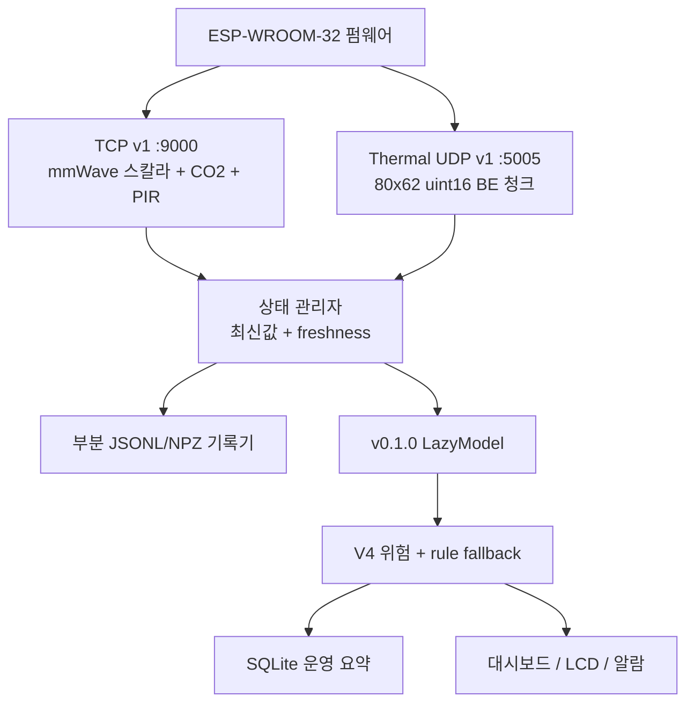

# SafeNest Raspberry Pi AI 런타임 활성화 로드맵 (한국어)

**문서 날짜:** 2026-08-16 (2026-08-18 현재상태 정정 안내 포함)
**문서 ID:** `RP-AI-ENABLEMENT-ROADMAP-01`
**영문 원본:** [`20260816_SafeNest_Raspberry_Pi_AI_Runtime_Enablement_Roadmap_01.md`](20260816_SafeNest_Raspberry_Pi_AI_Runtime_Enablement_Roadmap_01.md)
**로드맵 상태:** `2026-08-16 인간용 역사 요약 / 현재 실행 상태는 영문 원본 §0 우선`

이 문서는 영문 로드맵의 **사람용 한국어 판**이다. SHA, 계약 값, 파일 경로, 클래스 이름은 영문 원본과 같다. 구현 세부와 인용 근거가 충돌하면 **영문 원본을 우선**한다.

> **2026-08-18 현재상태 정정:** 이 한국어 본문은 2026-08-16 기준의
> 역사 요약이다. 현재 RP-X0 실행 해석과 상태는 영문 원본 §0의
> `2026-08-18 RP-X0 STATUS`가 권위 기준이다. Mac에서 가능한 active
> `yuname121/integration` 개발·replay·backend/API·상태/실패 격리·정적
> 배포 검사는 병합된 Stage 7/9 툴링으로 이미 `IMPLEMENTED / MERGED`다.
> Stage 7 preflight mmWave selector contract는 `RESOLVED_IN_CODE`다
> (`STAGE7_PREFLIGHT_MMWAVE_SELECTOR_DRIFT = RESOLVED_IN_CODE`).
> 추가 Mac RP-X0 구현은 필요 없다. 남은 경계는 실제
> Pi 배포/ARM·프로세스 검증 `PI_REQUIRED / NOT_RUN`과, 필요한
> 경우 실센서 live smoke `SENSOR_AND_PI_REQUIRED / NOT_RUN`이다. Thermal 다음 데이터/검증 경로와
> MR60-native live 검증은 각각 `SENSOR_REQUIRED`/`EXTERNAL_AI_DEPENDENCY`다.
> `PI_AVAILABLE`와 `SENSOR_AVAILABLE`은 독립 조건이므로, Pi가 없다고
> Mac 개발이 멈추지 않고 Pi가 있어도 필요한 센서가 없으면 새 센서 증거는
> 만들 수 없다.
> 스냅샷은 `READ_ONLY_FIELD_EVIDENCE`이며 개발 체크아웃이 아니다.
> PR #17 runtime-status, PR #19 LCD/Web O4, PR #20 Stage 7 Mac-offline,
> PR #21 Stage 9 툴링은 병합되어 있다. Stage 9 실제 live smoke는
> `SENSOR_AND_PI_REQUIRED / NOT_RUN`이다. PR #22는 mmWave primary selector를
> M-N9 FULL_INT8로 가리키며, O3 status는 아직 `MODEL_PENDING`이다.
> 위험 정책은 바꾸지 않는다.

**지금 승인된 것:** RP-A0 감사/설계는 문서 기준으로 끝난 상태다. `main`에 이 문서가 들어간 뒤 다음에 구현해도 되는 단계는 **RP-A1만**이다 (Capture 스키마, 세션/이벤트 식별, 합성 fixture, `captures/` gitignore). RP-A1 코드 자체, B-complete 모델 활성화, 이후 RP-B/C/D는 이 문서로 승인되지 않는다.

이 문서는 Capture 구현, ESP32 펌웨어 수정, 재학습, 동결 전처리/클래스맵/위험 임계값 변경, 대시보드 변경을 하지 않는다.

---

## 한 줄 요약

지금 Raspberry Pi는 **최신 값만 들고 관제하는 시스템**이다. B-complete AI를 쓰려면 **실제 센서 증거를 남기고(Capture) → 다시 재생하고(Replay) → 그다음에 정확한 모델을 켜는** 순서가 필요하다. 지금 돌아가는 기본 모델은 여전히 역사적 `v0.1.0`이다. 팀 PR #20이 머지됐다고 해서 Pi에 B-complete가 켜진 것은 아니다.

---

증거 태그:

| 태그 | 의미 |
|---|---|
| `CODE_VERIFIED` | 현재 통합 코드에서 확인 |
| `TEST_VERIFIED` | 현재 통합 테스트에서 확인 |
| `DOCUMENTED_ONLY` | 문서/매니페스트에만 있고 여기서 재실행하지 않음 |
| `OWNER_REPORTED` | 팀 PR/인수인계에 적혀 있음 |
| `INFERRED` | 인접 코드에서 추론, 추정으로 표시 |
| `PLANNED` | 앞으로의 설계. 현재 코드가 아님 |
| `BLOCKED_HARDWARE` | 실제 장비 측정 필요 |
| `BLOCKED_DEPENDENCY` | 외부 계약·아티팩트·오너 결정 필요 |

`PLANNED` 그림을 현재 구현으로 읽지 말 것.

---

## 1. 요약

현재 Pi 런타임은 동작하는 **최신 상태 관제 시스템**이다. ESP32 스칼라 TCP와 Thermal UDP를 받고, 신선도(freshness)를 붙인 최신 값을 유지하며, 입력이 맞을 때만 역사적 v0.1.0 TFLite를 돌리고, V4 위험을 합쳐 FastAPI·SQLite·LCD 호환 뷰·대시보드로 보낸다. `CODE_VERIFIED`

이것은 아직 **AI 증거 런타임이 아니다.** B-complete 후보는 고유한 물리 측정, 시간적으로 이어진 윈도우, 동결 전처리, 정확한 INT8 파일, 재생 가능한 계보가 필요하다. 지금 Pi는 대신:

- 최신 값만 남기고 CO₂를 60초 단위로 줄인다. `CODE_VERIFIED`
- 운영용 부분 기록기는 있지만, Capture/증거 계약은 아니다. `CODE_VERIFIED`
- `model_manifest.json` / `models.yaml`에서 역사적 `v0.1.0`을 로드한다. `CODE_VERIFIED` / `OWNER_REPORTED`
- 동결된 CO₂ 기울기 계약과 Thermal T-B5 물리 프레임 계약을 재구성하지 못한다. `CODE_VERIFIED`
- 검증된 mmWave phase 스트림이 없어 300샘플 BPF+Z-score 모델은 막혀 있다. `BLOCKED_DEPENDENCY`

목표 흐름:

```text
물리 센서 관측
  → ESP/장치 획득
  → Pi 수신
  → 지속 Capture (증거)
  → 정규 센서 관측
  → 제한된 런타임 버퍼
  → 동결 전처리
  → 정확한 B-complete TFLite/INT8
  → 센서 로컬 AI 맥락
  → 결정적 위험 로직
  → 알람 / LCD / 대시보드
  → Capture와 연결된 운영 SQLite
```

Pi는 없는 모델 입력을 추측하거나 만들어 내면 안 된다. **Capture를 B-모델 활성화보다 먼저** 시작해야, AI를 디버깅하는 동안 실제 센서 증거가 사라지지 않는다.

**이 문서가 승인하는 구현:** `APPROVED_FOR_RP-A1_ONLY`. 런타임 모델을 바꾸거나 Capture 코드를 시작하거나 실장비 검증 완료를 선언하지 않는다.

---

## 2. 범위와 비범위

### 이 문서 범위

- 현재 Pi 런타임 구조 감사
- 팀 PR #20 B-complete 계약 확인
- Capture / 런타임 상태 / AI 버퍼 / SQLite 분리
- 단계 게이트가 있는 Pi 활성화 로드맵
- Replay, provenance, 장애, 보존, Phase C 위치
- 현재-대-목표 표, 의존성, 리스크, 완료 정의

### 하지 않는 것 (미승인)

- Capture 또는 Pi 런타임 구현
- ESP32 펌웨어 수정
- 재학습, 양자화, 클래스맵·임계값 변경
- 동결 전처리 변경
- Risk Engine 가중치/임계값 수정
- 대시보드/HMI 동작 변경
- 하드웨어 시험 또는 하드웨어 검증 완료 주장
- Capture 세션을 학습 데이터로 취급
- 실제 Capture 페이로드를 Git에 커밋
- 형제 저장소 `../embed2` (`https://github.com/sheepmeat/test`) 작업

---

## 3. 저장소와 AI 기준선

### 3.1 통합 저장소

| 항목 | 값 | 근거 |
|---|---|---|
| 로컬 루트 (감사 당시 워크스페이스, 배포 경로 아님) | `.../2026/safenest-integration` | `CODE_VERIFIED` |
| Remote | `https://github.com/yuname121/integration.git` | `CODE_VERIFIED` |
| 감사 시점 `origin/main` | `df75640c5a196dea869423770c3938bb90839b83` | `CODE_VERIFIED` 2026-08-16 |

프롬프트에 적힌 SHA `0cab3af…`는 팀 PR 브랜치 끝이다. 이 저장소 `main`이 아니다.

### 3.2 통합 저장소 안의 동결 AI 스냅샷

`sources/ondevice_ai/`는 2026-08-13 스냅샷(`77b1695` / `fa8cf13`)이다. **C-B6 / T-B5 lock 파일이 없다.** 런타임 기본 모델은 역사적 `v0.1.0`이다. 이 스냅샷을 PR #20으로 취급하면 안 된다. `CODE_VERIFIED` / `DOCUMENTED_ONLY`

### 3.3 검토한 B-complete 기준선

팀 PR: [jinsu1011/safenest-embedded-competition#20](https://github.com/jinsu1011/safenest-embedded-competition/pull/20)
제목: `feat(ondevice-ai): sync B-complete offline candidate baseline`
상태: **MERGED** `OWNER_REPORTED`
머지 커밋: `6c3faea3126cff0d17565e534d019d344edc6d1a`
Standalone 원본: `https://github.com/sheepmeat/test` `efc7e2eb61a49e221ce0ebf6057b0c1617525ad1`

**B-complete의 의미:** 오프라인 후보와 재현/배포 계약이 팀 통합 계획에 쓸 수 있을 만큼 얼어 있다.
**아닌 것:** 실장비 검증, Pi 양산 배포, 최종 멀티센서 검증, 안전 인증. `OWNER_REPORTED`

### 3.4 책임 경계

| 쪽 | 맡는 일 | 맡지 않는 일 |
|---|---|---|
| 통합 / Pi | ESP→Pi 수신, 상태, Capture, 런타임 버퍼, AI 어댑터, 추론 오케스트레이션, 위험/출력, replay, Pi 배포 검증 | 데이터셋 출처, 학습, 모델 비교, 양자화, 오프라인 평가 |
| Standalone / 팀 `ondevice_ai` | 전처리 선택, 학습, 후보 lock, 아티팩트, validator, Phase C 측정 가이드 | Pi Capture writer, SQLite 스키마, 대시보드, ESP 펌웨어 |

---

## 4. 현재 Raspberry Pi 런타임

실제 실행 경로:

```text
deployment/run_pi.sh
  → hil/preflight.py
  → backend/run_backend.py
      → SQLite + SafeNestRuntime
          → TCP :9000 + Thermal UDP :5005
          → SensorStateManager
          → OnDeviceAIPipeline (v0.1.0)
          → SafeNestRiskEngine
          → FastAPI :8000 + SensorDataLogger
```

`gateway/run_*_gateway.py`는 진단용이다. 운영 경로는 `run_pi.sh`다.
활성 `state.json` writer는 없다. `/api/state`는 메모리 publication으로 만든다. `CODE_VERIFIED`



| 구성 | 경로 | 하는 일 | 저장 |
|---|---|---|---|
| TCP 수신 | `gateway/receiver.py` | 엄격 프레이밍, 시퀀스, 재연결 | 메모리 통계 |
| 프로토콜 | `gateway/protocol.py` | telemetry v1 + Thermal 80×62 BE | 없음 |
| Thermal UDP | `gateway/thermal_udp.py` | 9청크 재조립, CRC32, timeout | 메모리 메트릭 |
| 상태 | `state/manager.py` | 센서별 최신값, TTL, 최신 Thermal 프레임 | RAM만 |
| AI | `ai/pipeline.py` | v0.1.0 지연 로드, PIR rule | 최신 결과 + CO₂ deque 30개 |
| Risk | `risk/engine.py` | V4 융합, ppm 규칙, emergency | 최신 + CO₂ deque + PIR 무움직임 타이머 |
| SQLite | `database/` | 스냅샷·위험 이벤트 | `data/safenest.db` |
| Logger | `storage/sensor_logger.py` | mmWave JSONL, 60초 CO₂, Thermal NPZ | `data/{mmwave,co2,thermal}` |

현재 주기 `CODE_VERIFIED`:

- ESP 스칼라 텔레메트리 **1초**
- Thermal 요청 약 **6.25 FPS** (25 FPS / 분주 4, 실측 FPS는 운영값)
- CO₂ 사용 가능 값 승격 **60초**
- 위험/AI 평가 **15초**
- freshness TTL: mmWave/Thermal 3초, CO₂/PIR 10초

신선도는 Pi **단조시간**, 벽시계는 운영자 대조용이다.

---

## 5. 현재 센서 전송 계약

### 스칼라 TCP v1

`safenest.telemetry.v1`이 나르는 것: `device_id`, `seq`, `uptime_ms`, 호흡수, 심박수, `co2_ppm`, `pir_motion`, `valid.{respiration,heart,co2}`.

**없는 것:** 측정 이벤트 ID, 측정 단조시간, `boot_id`, 습도/온도, mmWave `breath_phase`/presence, Thermal 픽셀(Thermal은 UDP). `CODE_VERIFIED`

### Thermal UDP v1

ESP가 9개 datagram(`SNTU`, CRC32)을 보내고 Pi가 80×62 big-endian `uint16` 전체 프레임을 재조립한다. 불완전/CRC/shape/min-max 실패는 프레임을 버린다. ESP는 Thermal 큐가 한 칸이라 네트워크가 느리면 이전 프레임을 덮어쓴다. 그 손실은 Pi에 안 남는다.

`thermal_max_c`는 AI 프레임이 아니다. SQLite `thermal_max_temp_c`는 지금 `NULL`이다. `CODE_VERIFIED`

### mmWave 장치 계약

MR60 `breath_phase`의 의미·주기·동결 10 Hz / 30초 / 300샘플 BPF+Z-score 호환은 **별도 오너가 검증 중**이다. 통과 전:

```text
mmWave 실 phase 통합 = HOLD / DEPENDENCY
PENDING_MMWAVE_DEVICE_CONTRACT_VALIDATION
```

Pi는 호흡수/심박수로 phase를 합성하면 안 된다.

---

## 6. 현재 저장 / 데이터 손실 감사

| 센서 | Pi가 받는 것 | 메모리만 | 남는 것 | 되돌릴 수 없이 잃는 것 | AI 입력 재구성? |
|---|---|---|---|---|---|
| mmWave | 1 Hz 호흡/심박 스칼라. phase/presence 없음 | 최신 스칼라 | `data/mmwave/*.jsonl` 매 패킷 | raw phase, 300샘플 창 | B-complete **불가**. 스칼라만 |
| CO₂ | 1 Hz 캐시된 `co2_ppm`. 측정 ID 없음 | 60초 승격 전 값, deque 30 | 60초마다 유효 ppm만 | 물리 이벤트 정체성, 대부분 중간값, 150초 기울기 역사 | C-B6 **불가** |
| Thermal | UDP 80×62 전체 프레임 | pending 청크, 손실 메트릭, 최신 프레임 | 성공·기록된 NPZ | 불완전 프레임, 갭, CRC/단조시간, 큐 드롭 | 저장된 픽셀은 무손실. 세션 계보·드롭 연대기는 없음. T-B5 단위 변환은 Thermal-44 계약 없이 불가 |
| PIR | 매 스칼라 패킷 boolean | 최신값, 무움직임 시작 | SQLite 주기 스냅샷만. PIR 파일 없음 | 전이 시각, 패킷 정체성 | 정확한 전이 replay **불가** |

AI 예측·모델 SHA·텐서 해시는 추론마다 SQLite에 안 남는다. Logger drop은 `/health` 카운터뿐이라 증거 기록이 아니다.

핵심 손실:

1. 파싱된 객체만 있고 Capture 봉투가 없다.
2. CO₂는 물리 측정이 아니라 Pi 경과시간으로 다운샘플된다.
3. PIR은 logger가 안 쓴다.
4. Thermal 실패/갭은 메모리 메트릭이다.
5. mmWave phase는 현재 트래픽에서 복원할 수 없다.
6. 큐 overflow·크래시·정전은 대기 중 logger 항목을 잃을 수 있다.
7. quota 정리는 센서별 파일을 따로 지워 세션 단위 replay가 깨진다.

---

## 7. B-complete AI 계약 요약

PR #20 머지 `6c3faea…`와 `20260816_b_complete_active_offline_candidates.json` 기준. `DOCUMENTED_ONLY` / `OWNER_REPORTED`

### 7.1 mmWave

| 항목 | 동결 값 |
|---|---|
| 후보 | `M-B3_CONV1D_GAP_BASELINE_seed42_M-B5_CAL_CLASS_BALANCED_120` |
| SHA-256 | `6dff6aaa72c79d76715d40cf7e32bb1e6cd9b2c2e3ac78eaf2fda737561430c5` |
| 입력 | INT8 `[1,300,1]`, 10 Hz, 30초, 300샘플 |
| 전처리 | `BPF_ZSCORE` |
| 클래스 | `NORMAL` / `RAPID_OR_ABNORMAL` / `APNEA` |
| APNEA | 자발적 호흡정지 **프록시**. 임상 apnea 아님 |
| 런타임 기본 | 여전히 v0.1.0. v0.1.0은 class collapse로 `deployment_allowed=false` |
| 장치 도메인 | **미완료**. 지금은 live phase 입력 구현 금지 |

v0.1.0은 z-score only이고 양자화도 다르다. `models.yaml`만 후보 파일로 바꾸면 틀린다.

### 7.2 CO₂ (C-B6)

| 항목 | 동결 값 |
|---|---|
| 후보 | `C_B6_REDUCED_CO2_SLOPE_CANDIDATE_001` |
| INT8 SHA-256 | `c5969b367f5b5e28c4d27f1bdd6220f7d02da92e99604e3f85c9f1291e98dd3b` |
| 피처 순서 | `CO2`, `CO2_slope` |
| 금지 입력 | 온도, 습도, Light, 시각, 이전 예측 등 |
| 기울기 | 소스 시계 기준 `ENDPOINT_DIFFERENCE`, 150초, 최소 2샘플, 경과 150초 |
| 갭 | 90초 초과면 이력 재시작 |
| Scaler | TRAIN-only StandardScaler, mean `[606.5058…, 0.011527…]`, scale `[314.3524…, 5.66167…]` |
| INT8 입력 | `[1,2]`, scale `0.03921568766236305`, zp `0` |
| INT8 출력 | `[1,1]` logistic, threshold **0.43** (`TRAIN_INTERNAL_ONLY`) |
| 클래스 | `VACANT` / `OCCUPIED` (방 점유). 안전/위험 의미 **없음** |
| SCD40 Phase C | **미완료** |

지금 Pi v0.1.0과의 차이 (깨지는 변경):

| 항목 | 지금 Pi / v0.1.0 | C-B6 |
|---|---|---|
| 피처 | `CO2_slope, Humidity, CO2` | `CO2, CO2_slope` |
| 입력 | `[1,3]` | `[1,2]` |
| 출력 | `[1,2]` softmax | `[1,1]` logistic |
| 습도 | 필수 → 없어서 `INPUT_UNAVAILABLE` | 금지 |
| 기울기 창 | 60초 승격 샘플 30개의 deque | 150초 엔드포인트, 90초 갭 리셋 |
| 로컬 스냅샷 | v0.1.0 + C-B5 4피처 | C-B6 **없음** |

점유 모델은 CO₂ 안전 임계값, 센서 health, 멀티센서 위험이 아니다.

### 7.3 Thermal (T-B5)

| 항목 | 동결 값 |
|---|---|
| 후보 | `FULL_INT8` / `SMALL_CNN_BASELINE_V1_P1_full_int8.tflite` |
| SHA-256 | `fa9730c29535477a3994c11e664474a0ca0116afaaa172889f47446ab2ac46be` |
| Git 바이너리 | **없음.** `EXTERNAL_SSD_ONLY` |
| 입력 | INT8 `[1,62,80,1]`, scale `0.3179…`, zp `-125` |
| 출력 | INT8 `[1,3]` |
| Float 전처리 | 섭씨 프레임에 `P1_TRAIN_FITTED_GLOBAL_ZSCORE` (mean ≈ 22.77, std ≈ 2.87) |
| `HUMAN_FALL` | 원본 `LYING`의 **자세 프록시**. 검증된 `FALL_EVENT`가 아님 |
| Thermal-44 단위/방향 | `UNVERIFIED`. SDT 켈빈 공식을 Thermal-44에 몰래 쓰면 안 됨 |

지금 Pi는 **프레임별 min-max → [0,1]** 후 v0.1.0 양자화(zp `-128`)다. T-B5와 다른 모델이다. `thermal_max_c`를 모델 입력으로 쓰면 안 된다.

### 7.4 PIR

PIR AI 모델은 없다. 보조 증거 / 위험 맥락만 쓴다. `CODE_VERIFIED`

---

## 8. 현재 대 목표 갭

| 구성 | 지금 Pi | B-complete 요구 | 갭 | Pi가 할 일 | 외부 의존 |
|---|---|---|---|---|---|
| CO₂ | 60초 ppm, 습도 게이트 `[1,3]` | 고유 이벤트, 150초 기울기, `[CO2, CO2_slope]` `[1,2]` | 정체성·피처·출력·기울기 전부 다름 | Capture + 버퍼 + C-B6 어댑터 | ESP 측정 ID, 스냅샷 동기화, SCD40 Phase C |
| Thermal | UDP 재조립, min-max v0.1.0 | 전체 프레임 Capture, 단위/방향, T-B5 | 전처리 다름, 바이너리 없음 | 전체 프레임 Capture, 단위 확정 후 T-B5 | T-B5 배포, Thermal-44 단위 |
| mmWave | 스칼라만 | 10 Hz phase 300, BPF_ZSCORE | phase 없음 | 게이트 전 placeholder만 | MR60 phase 계약 |
| PIR | 최신 bool | 전이 증거 | 전이 유실 | 첫 상태 + 전이 Capture | Capture는 Pi만으로 가능 |
| 모델 로딩 | v0.1.0 기본 | B-complete SHA 검증 | 기본값이 구버전 | 전용 활성화 단계 | 아티팩트 위치 |
| Capture | 시간별 logger | 세션 증거 저장소 | 증거 계약 아님 | Capture v1 | CO₂ 정체성(정확 기울기 replay용) |
| Replay | 없음 | Capture→전처리→동일 모델 | 없음 | RP-A5 이후 | 모델 아티팩트 |
| Risk | Thermal AI 사용, 점유는 점수에 안 씀 | AI는 맥락, ppm/rpm 규칙을 점유로 대체하지 말 것 | 의미 혼동 위험 | 명시적 맥락 필드 | 점유를 융합에 넣을지 오너 결정 |

---

## 9. 목표 Pi 구조

수신 이후 길이 두 갈래다.

1. **Capture / Replay:** 증거 보존, 나중에 같은 입력으로 재실행
2. **런타임 / AI / Risk:** 최신 상태, 짧은 버퍼, 동결 전처리, 모델, 위험, 화면

네 저장 책임은 섞지 않는다.

| 층 | 목적 | 수단 |
|---|---|---|
| A. Capture / 증거 | 실장비 증거, replay, 장애 진단, 모델 입력 재구성, Phase C | `captures/<session>/` JSONL + Thermal NPZ |
| B. 런타임 센서 상태 | 최신 유효값, freshness, health | `SensorStateManager` RAM |
| C. AI 롤링 버퍼 | CO₂ 150초, 이후 mmWave 300샘플, 최신 Thermal 프레임 | 제한 RAM. 연속성 깨지면 리셋 |
| D. 운영 요약 | 위험 이력, 알람, 운영자 화면 | 기존 SQLite |

---

## 10. Capture v1

권장 세션 배치 `PLANNED`:

```text
captures/
└── <session_id>/
    ├── manifest.json
    ├── events_0001.jsonl
    ├── thermal/frames_0001.npz
    ├── inference/records_0001.jsonl
    └── session_close.json
```

4960 픽셀은 일반 JSONL에 넣지 않는다. SQLite에도 넣지 않는다.

지금 `storage/sensor_logger.py`의 좋은 점(수신 콜백에서 디스크 I/O 안 함, Thermal 배치, `/health` 카운터)은 남기고, 계약은 바꾼다.

- 시간별 폴더가 아니라 세션
- PIR과 손실 이벤트 포함
- Capture에는 60초 CO₂ 다운샘플 금지
- 단조 수신시간, CRC, checksum
- Capture health와 SQLite health 분리
- 삭제는 닫힌 세션 단위

Thermal 페이로드는 **무손실 NPZ 배치** (`allow_pickle=False`)를 권한다. 현재 logger가 이미 `(batch, 62, 80) uint16`을 쓴다.

---

## 11. 세션 / 시각 / provenance

경진대회 권장: **통합 Pi 프로세스 실행당 Capture 세션 하나.** ESP 재연결은 같은 세션의 전송 이벤트로 남긴다. 프로세스 재시작은 새 세션이다.

시각을 하나의 `timestamp`로 합치지 말 것.

| 이름 | 출처 | 용도 |
|---|---|---|
| 장치/소스 측정 시각 | 센서 획득 시계 (계약이 줄 때) | 기울기, phase 주기, 고유성 |
| 장치 uptime | ESP `uptime_ms` | 재부팅/불연속 |
| Pi 수신 벽시계 | `time.time()` | 운영자 대조 |
| Pi 수신 단조시간 | `time.monotonic()` | freshness, 수신 순서 |
| AI 추론 시각 | 평가 시계 | provenance |
| 위험 결정 시각 | 지금 15초 평가 시계 | provenance |
| 화면/알람 게시 시각 | store publish | HMI/SQLite |

없는 필드는 ID를 지어내지 말고 **없음**을 명시한다. 지금 TCP v1에는 `boot_id`, CO₂ 측정 이벤트 ID/측정 시각이 없다.

---

## 12. CO₂ 런타임 계획

```text
SCD40 측정
  → ESP 캐시 + 텔레메트리
  → 측정 이벤트 ID + 소스 시각     [ESP 의존]
  → Pi Capture (고유 물리 이벤트)
  → 150초 이력 버퍼
  → 동결 ENDPOINT_DIFFERENCE 기울기
  → TRAIN scaler, 순서 [CO2, CO2_slope]
  → C-B6 INT8 [1,2]
  → 0.43 기준 VACANT / OCCUPIED 맥락
  → 위험은 당분간 ppm/기울기 안전 규칙 유지
```

| 층 | 저장 | 리셋 |
|---|---|---|
| Capture | 고유 SCD40 측정. ID가 없으면 전송 관측을 `measurement_identity_unavailable`로 정직하게 남김. 값 같음으로 고유하다고 하지 말 것. 60초 게이트 금지 | 주기 리셋 금지. 세션 종료/보존만 |
| 런타임 버퍼 | 약 150초 + 90초 갭 여유 | 새 세션, 재부팅, 갭 > 90초, 긴 invalid, 시각 불연속 |
| 기울기 | 버퍼에서 다시 계산. ppm을 덮어쓰지 않음 | 버퍼와 함께 무효 |

워밍업·갭·비유한·STALE·모델 없음은 `NO_INFERENCE`다. 잘못된 입력을 `VACANT`로 바꾸지 말 것.

오프라인 C-B6는 UCI 약 60초 cadence다. SCD40은 보통 약 5초 data-ready이고 ESP는 1 Hz로 최신 ppm을 보낸다. **가짜 UCI 주기로 리샘플하지 말고**, 실제 이벤트 시각으로 동결 식을 계산한다.

---

## 13. Thermal 런타임 계획

이미 있는 것: UDP 재조립, CRC, 80×62, RAM 최신 프레임, 부분 NPZ.
새로 할 것: 세션 Capture, checksum, 손실 이벤트.
막힌 것: Thermal-44 raw → °C, 방향, T-B5 바이너리.

T-B5는 프레임 전용이다. RAM에는 검증된 현재 프레임만. 무제한 프레임을 RAM에 두지 말 것.

`LYING` / `HUMAN_FALL`은 자세 프록시다. 지금 Risk는 confidence ≥ 0.8인 `HUMAN_FALL`을 emergency DANGER 100으로 올린다. `CODE_VERIFIED` 이 동작은 RP-C0에서 검토한다. 이 로드맵은 그 임계값을 바꾸지 않는다.

---

## 14. mmWave — 의존성 게이트

지금은 모델 입력을 Pi에 구현하지 않는다.

```text
MR60 breath_phase 실장비 계약
  → 주기 검증
  → 10 Hz / 300 / BPF_ZSCORE 의미 호환
  → 그다음에야 phase Capture, 롤링 윈도우, INT8
```

게이트 전: 스칼라 호흡/심박은 기록, `phase_unavailable` 명시, AI는 `INPUT_UNAVAILABLE`, 위험은 rpm rule, v0.1.0도 B-complete도 live 기본값으로 켜지 않음.
단계: **RP-B3**, `MMWAVE_DEVICE_CONTRACT_DEPENDENCY`로 **현재 차단**.

---

## 15. PIR

모델 없음. 최신 상태 + 첫 관측/boolean 전이만 Capture. 1 Hz `false` 반복은 새 관측으로 쌓지 말 것. 위험은 기존 무움직임 규칙(presence 확인 후).

---

## 16. 모델 아티팩트 / 활성화

| 센서 | 지금 기본 | B-complete |
|---|---|---|
| Thermal | `thermal_fall_int8_v0.1.0.tflite` | T-B5 SHA `fa9730c2…` **git에 없음** |
| CO₂ | `co2_occupancy_int8_v0.1.0.tflite` | C-B6 SHA `c5969b36…` **로컬 스냅샷에 없음** |
| mmWave | v0.1.0 blocked | M-B3 SHA `6dff6aaa…` 오프라인 후보, `deployment_ready=false` |

`models.yaml`만 바꾸면 안 된다. 활성화는 **Capture 이후 RP-B0**. SHA, 매니페스트, 입력 계약, 전처리, 클래스맵, LiteRT, 실패 시 fail-closed를 먼저 확인한다.

T-B5 바이너리 배포 권장: 경진대회는 **Pi 프로비저닝 때 복사 + SHA 검증**. 없으면 `MODEL_UNAVAILABLE`. checksum을 건너뛰지 말 것. 파일이 Pi에 있다고 가정하지 말 것.

---

## 17. 전처리 / 입력 검증

오프라인·Pi·replay가 서로 다른 전처리를 가지면 안 된다. **동결 함수 하나**를 런타임과 replay가 같이 쓴다.

추론 전: shape, dtype, 피처 순서, 물리 단위, 유효성, 시간 연속성.
실패 시 `INPUT_INVALID` / `INPUT_WARMUP` / `INPUT_STALE` / `MODEL_UNAVAILABLE` / `NO_INFERENCE`.
잘못된 입력을 정상 클래스로 넣지 말 것.

---

## 18. AI provenance

추론마다 최소한: `inference_id`, `session_id`, 소스 이벤트/프레임, `model_id`, `model_sha256`, 전처리 프로필, 입력 계약 버전, 검증 결과, 출력 클래스, (CO₂) 0.43 임계값, 위험 결과 참조.

모델 출력을 교정된 확률로 가정하지 말 것. C-B6 임계값은 `TRAIN_INTERNAL_ONLY`다.
추론 JSONL은 Capture 세션에, SQLite에는 요약+ID만.

---

## 19. SQLite

운영 요약 저장소로 유지한다. 원본 Thermal 프레임·phase 윈도우를 넣지 말 것.
나중에 `session_id` / `capture_event_id` / `inference_id`를 **추가** 필드로 연결한다 (RP-B4).
재시작 복원은 지금처럼 상태/위험/emergency만. raw 센서는 복원하지 않는다.

---

## 20. Replay

```text
저장된 Capture
  → validator
  → 정규 관측 스트림
  → 같은 동결 전처리
  → 같은 모델 파일
  → 예측
  → 원래 런타임 결과와 비교
```

답해야 하는 질문: 소스가 틀렸나, 전송이 빠졌나, stale인가, 전처리가 달랐나, 모델이 달랐나, 양자화가 바꿨나, 알람이 AI가 아니라 risk인가.

CO₂ ID가 없으면 “정확한 기울기 재구성 불가”라고 말하고, ppm 값으로 몰래 중복 제거하지 말 것.

---

## 21. Risk Engine

지금 `CODE_VERIFIED`:

| 구성 | 실제 센서 | AI | 없을 때 | Emergency |
|---|---|---|---|---|
| Thermal | LIVE 필요 | **사용** (rule fallback 없음) | unavailable | `HUMAN_FALL` + confidence ≥ 0.8 → DANGER 100 |
| mmWave | LIVE + rpm | 300창이 있을 때만 (지금은 없음) | 12–20 rpm rule | `apnea_verified`일 때만. 지금은 항상 false |
| CO₂ | LIVE + ppm | 점유는 **점수에 안 씀** | unavailable | 1000/2500 ppm, 15 ppm/min |
| PIR | LIVE + bool | rule만 | 타이머 리셋 | 장시간 무움직임은 presence 필요 |

B-complete를 넣을 때:

- `OCCUPIED`는 맥락. 1000/2500 ppm 규칙을 점유로 바꾸지 말 것
- `HUMAN_FALL`은 자세 프록시. emergency를 조용히 강화하지 말 것
- mmWave 클래스는 게이트 후. 미검증 APNEA로 emergency 금지

V4 가중치 `0.35/0.35/0.15/0.15`와 30/60 임계값은 이 로드맵에서 바꾸지 않는다.

---

## 22. 버퍼 리셋 / 로테이션 / 보존

로테이션 ≠ 리셋 ≠ 삭제.

| 데이터 | 리셋/로테이션 | 삭제 |
|---|---|---|
| Capture | 세션 종료, 파일 크기/시간 로테이션 | 예산/여유공간 정책으로 **닫힌** 오래된 세션. 활성 세션 주기 삭제 금지 |
| AI 버퍼 | 새 세션, 재부팅, 갭, 시각 불연속 | RAM만. Capture는 지우지 않음 |
| 현재 상태 | 더 새 유효값으로 교체 | 프로세스 수명 |
| SQLite | 별도 보존 | AI 버퍼 리셋 때문에 지우지 않음 |

실제 세션이 생기기 전에 `captures/`를 gitignore에 넣는다.

---

## 23. 장애 처리

Capture가 켜져 있다고 보고하면서 실제로 안 남기면 안 된다.

디스크 가득, writer 실패, 큐 overflow, 손상, 로테이션 실패, 크래시/정전, SQLite 실패는 각각 보여야 한다.
상태: `capture_healthy` / `capture_degraded` / `capture_failed`. `/health`에 노출.
SQLite 실패와 Capture 실패는 따로 본다.

---

## 24. Pi 성능 검증

**RP-C2. 지금은 통과가 아니다.** CPU, RAM, 디스크, Thermal 기록 대역, 추론 지연, 모델 로드, 큐 깊이, 네트워크 손실, Pi 온도, 수시간 가동, 재시작 복구를 나중에 측정한다.

---

## 25. 실장비 Phase C

Capture, 입력 재구성, 모델 활성화, replay가 된 **다음**에 한다.

| 트랙 | 선행 |
|---|---|
| MR60 / M-C | phase 계약 + Pi phase Capture |
| SCD40 / C-C | 측정 ID + C-B6 기울기 재현 |
| Thermal / T-C | 단위/방향 + T-B5 + 전체 프레임 Capture |
| 멀티센서 동기 | 위 셋 + 시계/세션 정렬 |

Capture는 자동으로 학습 데이터가 아니다.

```text
Capture → 품질 검토 → 시나리오/라벨 검토
  → 필요 시 개인정보/동의
  → 데이터셋 편입 → 정규화 → 학습
```

학습은 AI 저장소 일이다.

---

## 26. 단계별 로드맵

기존 통합은 `PHASE 1`–`PHASE 10` + HIL이다. 이 시리즈는 **`RP-`** 접두어를 써서 안 겹친다.

RP-A0은 이 문서로 문서 게이트를 충족한다. 구현은 로드맵이 `main`에 들어간 뒤 **다른 브랜치에서 RP-A1만** 시작한다.

| 단계 | 제목 | 한 줄 | 지금? |
|---|---|---|---|
| RP-A0 | 현재 런타임/저장 감사 | 이 문서 | 문서 완료 |
| **RP-A1** | Capture 스키마·세션 계약 | 스키마, fixture, gitignore | **다음 승인 구현** |
| RP-A2 | Capture writer·저장 health | 세션, 로테이션, 실패가 보이게 | A1 후 |
| RP-A3 | CO₂ / PIR 이벤트 Capture | 60초 다운샘플 없이, PIR 전이 | A2 후 |
| RP-A4 | Thermal 전체 프레임 Capture | 무손실 NPZ, 불완전은 오류 이벤트 | A2 후 |
| RP-A5 | 정규 Replay | 모델 없이도 증거 재생 | A3+A4 후 |
| RP-B0 | 아티팩트 해석·계약 검증 | v0.1.0 기본 유지한 채 SHA/fail-closed | Capture 후 |
| RP-B1 | CO₂ C-B6 런타임 | 점유는 맥락만 | B0 + C-B6 파일 |
| RP-B2 | Thermal T-B5 런타임 | 단위 미확정이면 `MODEL_UNAVAILABLE` | T-B5 바이너리 + 단위 |
| RP-B3 | mmWave | 장치 계약 후 | **현재 차단** |
| RP-B4 | provenance + SQLite 연결 | 증거 ID로 추적 | A5 후 |
| RP-C0 | Risk 맥락 통합 | 클래스·ppm·health·위험을 섞지 않음 | B1/B2 후 |
| RP-C1 | 장애 주입 / fail-closed | 잘못된 입력이 정상 클래스 되지 않음 | A2 후 |
| RP-C2 | Pi 장기 성능 | 측정 보고서 | 하드웨어 |
| RP-D0 | 실장비 Phase C | 센서별 도메인 검증 | Capture+replay+활성화 후 |
| RP-D1 | 재현 게이트 | 다른 Pi에서도 SHA/replay 일치 | “크래시 없이 돌아감”이 아님 |

### RP-A1 (다음에 해도 되는 유일한 구현)

- **목적:** Capture 스키마, 세션 ID, 이벤트 종류, 시각 필드, Thermal 페이로드 인덱스를 기계가 읽게 고정. 실제 운영 세션은 아직 안 씀.
- **범위:** JSON 스키마, 합성 fixture, `captures/` gitignore, checksum 규칙.
- **비범위:** 수신 경로 live writer, ESP, 모델.
- **완료:** 합성 세션이 검증되고, 실제 페이로드가 Git에 없다.
- **담당:** Pi 런타임 오너. 검토: 팀 통합 리뷰어.

이후 단계의 목적·범위·완료 조건·담당은 영문 원본 §26과 같다. 한국어 표는 읽기용 요약이다.

---

## 27. 의존성 표

| 요구 | Pi가 지금 구현 가능 | 외부 의존 | 막는 단계 | 담당 |
|---|---:|---|---|---|
| Capture 스키마/writer/health | 예 | — | RP-A1/A2 | Pi 런타임 |
| CO₂ 전송 관측 Capture | 예 | 정확한 고유성은 ESP ID | RP-A3 | Pi / CO₂ / ESP |
| PIR 전이 Capture | 예 | — | RP-A3 | Pi |
| Thermal 전체 프레임 | 예 | — | RP-A4 | Pi / Thermal |
| 원본 증거 Replay | A3/A4 후 | — | RP-A5 | Pi |
| B-complete 스냅샷 | 아니오 (로컬에 없음) | AI 기준선 복사 | RP-B0 | AI 오너 |
| C-B6 INT8 | 스냅샷 후 | 팀 저장소에 이미 추적됨 | RP-B1 | AI / CO₂ / Pi |
| T-B5 INT8 | 아니오 | `EXTERNAL_SSD_ONLY` | RP-B2 | AI / Thermal / 오너 결정 |
| Thermal-44 °C / 방향 | 아니오 | 장치 도메인 계약 | RP-B2 / D0 | Thermal |
| mmWave phase | 아니오 | MR60 계약 | RP-B3 | mmWave |
| 점유→위험 융합 변경 | 배관은 가능 | 정책 결정 | RP-C0 | Risk |
| V4 임계값/가중치 변경 | 이 로드맵 아님 | 별도 정책 PR | 보류 | Risk |
| Pi 장기 측정 | 아니오 | 하드웨어 | RP-C2 | Pi |
| Phase C | 아니오 | 하드웨어 + Capture/replay | RP-D0 | 센서 오너 |
| 대시보드 변경 | 아니오 | 범위 밖 | — | 대시보드 |

분류: `PI_IMPLEMENTABLE_NOW`, `ESP_CONTRACT_DEPENDENCY`, `AI_BASELINE_DEPENDENCY`, `MMWAVE_DEVICE_CONTRACT_DEPENDENCY`, `MODEL_ARTIFACT_DEPENDENCY`, `HARDWARE_VALIDATION_DEPENDENCY`, `OWNER_DECISION_REQUIRED`.

---

## 28. 소유권

사람 이름은 적지 않는다. 역할만.

| 영역 | 오너 역할 | 리뷰어 |
|---|---|---|
| Pi 수신/상태/런타임 | Pi 런타임 오너 | 팀 통합 리뷰어 |
| Capture/replay | Pi 런타임 오너 | 팀 통합 리뷰어 |
| ESP 측정 ID | ESP/장치 오너 | Pi 런타임 |
| B-complete 계약/파일 | AI 오너 | 팀 통합 리뷰어 |
| mmWave phase 계약 | mmWave 오너 | AI 오너 |
| CO₂ 기울기/SCD40 | CO₂ 오너 | AI 오너 |
| Thermal-44 단위/방향 | Thermal 오너 | AI 오너 |
| 위험 융합 의미 | Risk 오너 | 팀 통합 리뷰어 |
| 대시보드/LCD | 대시보드 오너 | 이 문서 범위 밖 (health 필드 제외) |

---

## 29. 검증 표

| 영역 | 나중에 필요한 시험 |
|---|---|
| Capture | append-only, 로테이션, 세션 수명, checksum, 정전/unclean, 디스크 가득, 큐 overflow |
| CO₂ | 고유 이력(ID 있을 때), ID 없음의 정직함, 150초 기울기, 워밍업, 90초 갭, 런타임/replay 동등 |
| Thermal | UDP 재조립, 무손실 프레임, 부분 프레임을 정상으로 안 씀, 단위 변환은 계약 후, INT8 |
| mmWave | 게이트 전까지 차단. 이후 주기·창·갭·BPF 동등 |
| AI | checksum, 입력 계약, Float/INT8, 런타임/replay 동등 |
| Risk | 결측/stale/AI 없음/잘못된 입력, emergency, 점유가 조용히 알람 되지 않음 |
| Pi | 지연·CPU·RAM·디스크·온도·장기·재시작 — RP-C2만 |

---

## 30. 리스크 레지스터

근거 있는 심각도만.

| ID | 내용 | 심각도 |
|---|---|---|
| R1 | 런타임 기본이 여전히 v0.1.0. B-complete 미로드 | P0 |
| R2 | T-B5 INT8가 git/배포 경로에 없음 | P0 |
| R3 | 통합 스냅샷이 2026-08-13. C-B6/T-B5 없음 | P0 |
| R4 | 세션 raw Capture 없음. CO₂ 다운샘플, PIR 생략 | P0 |
| R5 | CO₂ 물리 측정 ID 없음. 60초 틱 ≠ SCD40 고유 이벤트 | P0 |
| R6 | 지금 CO₂ AI는 습도 `[1,3]` softmax. C-B6는 `[1,2]` logistic | P0 |
| R7 | Thermal min-max v0.1.0 ≠ T-B5 섭씨+P1 z-score | P0 |
| R8 | mmWave phase 입력 차단 | P0 |
| R9 | Thermal-44 단위/방향 미검증. SDT 켈빈 공식 가정 금지 | P1 |
| R10 | 전처리가 오프라인/Pi/replay로 갈라질 위험 | P1 |
| R11 | CO₂ 통신은 1 Hz인데 사용 값은 60초 지연될 수 있음 | P1 |
| R12 | 로드 시 SHA는 있으나 추론마다 provenance 없음 | P1 |
| R13 | Capture/logger 실패가 카운터뿐. 런타임은 살아 보여 조용히 유실 | P1 |
| R14 | SQLite가 증거와 안 연결됨 | P2 |
| R15 | `HUMAN_FALL` emergency가 누운 자세 프록시를 DANGER로 볼 수 있음 | P1 |
| R16 | `OCCUPIED`를 밀폐 위험으로 오해할 수 있음 | P1 |
| R17 | mmWave v0.1.0 class collapse 우회 위험 | P1 |
| R18 | 실험용 mmWave 전처리가 lock 경로가 아님 | P2 |
| R19 | `captures/` gitignore 아직 없음 | P2 |
| R20 | README provenance SHA가 PR #20보다 오래됨 | P3 |
| R21 | Pi 장기 가동 / Phase C 미실시 | P2 |

---

## 31. 완료 정의

`FINAL_DEPLOYMENT_READY`는 “모델이 안 죽고 돈다”가 아니다.

| 게이트 | 객관 기준 |
|---|---|
| `PI_CAPTURE_READY` | 세션 매니페스트, append-only 이벤트, Thermal NPZ, unclean 감지, Capture health 노출, Git에 실제 페이로드 없음, PIR 전이+CO₂ 관측 저장, mmWave phase 위조 없음 |
| `CO2_RUNTIME_READY` | 고유하거나 정직하게 미식별된 이벤트, 150초 기울기, 90초 갭 리셋, C-B6 SHA `c5969b36…`, `[1,2]` INT8, 0.43, 습도 없음, 잘못된 입력은 추론 없음, 점유는 맥락만 |
| `THERMAL_RUNTIME_READY` | 전체 프레임 왕복, 승인된 단위/방향 **또는** 명시적 `MODEL_UNAVAILABLE`, T-B5 SHA `fa9730c2…`, 전처리 공유, `HUMAN_FALL`은 자세 프록시 |
| `MMWAVE_RUNTIME_READY` | 문서화된 MR60 phase 계약, 주기/갭 증거, 300샘플, BPF_ZSCORE, SHA `6dff6aaa…`, 스칼라→phase 합성 없음 |
| `AI_PROVENANCE_READY` | 추론마다 ID, 모델 SHA, 전처리, 소스 참조. SQLite blob과 분리 |
| `REPLAY_READY` | 같은 전처리·같은 파일로 저장 결과를 재현하거나 차이를 설명 |
| `RISK_CONTEXT_READY` | AI 클래스, ppm/rpm 임계, health, 위험 상태가 API/SQLite에서 구분됨 |
| `PI_LONG_RUN_READY` | RP-C2 측정이 기록됨 |
| `REAL_DEVICE_VALIDATION_READY` | 센서별 Phase C 보고서 + 그 런의 Capture가 replay 가능 |
| `FINAL_RUNTIME_REPRODUCIBLE` | 두 번째 Pi에서 아티팩트 SHA, Capture 스키마, replay 해시가 맞음 |

---

## 32. 미룬 일

- ESP에 CO₂ 측정 이벤트 ID·소스 측정 시각 추가
- MR60 `breath_phase` 실장비 계약
- Thermal-44 물리 단위·방향
- T-B5 바이너리 배포 정책
- 런타임 기본값을 v0.1.0에서 바꾸기
- V4 가중치/임계값 또는 Thermal emergency 변경
- 대시보드 동작
- Capture를 학습 데이터로 쓰기
- 임상 apnea·검증된 낙상 사건 주장
- XIAO ESP32-C6 펌웨어 포트
- 별도 승인 없는 RP-A1~RP-D1 구현

---

## 부록 A. 센서 계약 한눈에

| 센서 | 장치→Pi | 모델 입력 | Pi가 만드는 것 | 지속 저장 | 롤링 상태 | 지금 |
|---|---|---|---|---|---|---|
| CO₂ | 1 Hz ppm, 이벤트 ID 없음 | `[CO2, CO2_slope]` `[1,2]` | 150초 엔드포인트 기울기 | 고유 이벤트 또는 정직한 전송 관측 | ~150초 | Capture 부분. 런타임 AI는 C-B6 아님 |
| Thermal | UDP 80×62 전체 프레임 | 정규 `(62,80)` → INT8 | 단위 변환 + P1/T-B5 (계약 후) | JSONL 메타 + NPZ | 최신 프레임만 | 전송 준비. T-B5는 차단 |
| mmWave | 스칼라 rpm/hr만 | 300 phase INT8 BPF_ZSCORE | 게이트 후 윈도우 | 지금은 스칼라 | 없음 | 차단 |
| PIR | 1 Hz boolean | 없음 | 무움직임 경과 | 전이 | 최신 + 타이머 | 상태는 됨. Capture 없음 |

## 부록 B. 코드 재사용

처음부터 Pi를 다시 짜지 않는다. 구조는 쓸 만하고, 구멍은 저장·계약·활성화다.

| 영역 | 처분 |
|---|---|
| `gateway/` TCP·프로토콜 | PRESERVE |
| `gateway/thermal_udp.py` | EXTEND (손실 이벤트) |
| `state/manager.py` | EXTEND (Capture 저장소로 쓰지 말 것) |
| `storage/sensor_logger.py` | REFACTOR 후 REPLACE_LATER |
| SQLite | PRESERVE + 연결 필드 EXTEND |
| `ai/pipeline.py` | REFACTOR (C-B6/T-B5, 습도 게이트 제거, phase 합성 금지) |
| `risk/engine.py` | EXTEND (가중치/임계값 변경 없음) |
| 대시보드 | PRESERVE |

## 부록 C. 저장량 (알려진 주기만)

ESP 스칼라 **1.0 Hz**. Thermal 요청 약 **6.25 FPS** (펌웨어 요청, Pi 실측 아님).

- CO₂ 1 Hz JSONL: 시간당 약 0.4–0.7 MB
- Thermal 비압축: 6.25 FPS면 시간당 약 **223 MB** (NPZ 압축 전)
- PIR은 전이만 남기면 훨씬 작다. 1 Hz 전부 저장은 비추천

Thermal이 용량을 지배한다. 일수를 약속하지 말고 닫힌 세션과 디스크 예산으로 보존한다. 현재 logger 10 GB / Thermal 8.5 GB 할당은 Capture v1 보존 약속이 아니다.

---

## 승인 스탬프

```text
로드맵 상태:              APPROVED_FOR_RP-A1_ONLY
Pi Capture 코드:          NO
Pi 런타임 수정:           NO
ESP 펌웨어:               NO
모델 활성화:              NO
models.yaml 변경:         NO
전처리 변경:              NO
Risk Engine 변경:         NO
대시보드 변경:            NO
Phase C 실행:             NO
하드웨어 시험:            NO
여기서 RP-A1 시작:        NO
```

**다음 일:** 이 문서(영문+한국어) 문서 PR을 머지한 뒤, 갱신된 `main`에서 **RP-A1 전용 새 브랜치**를 연다.
